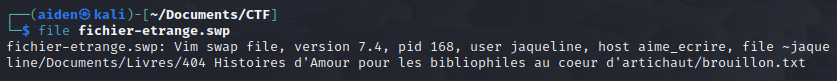
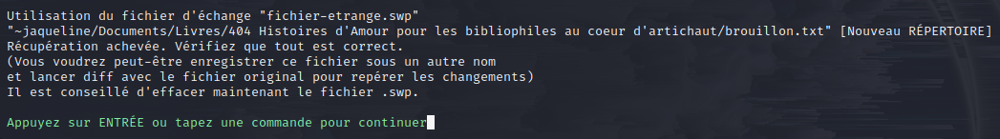
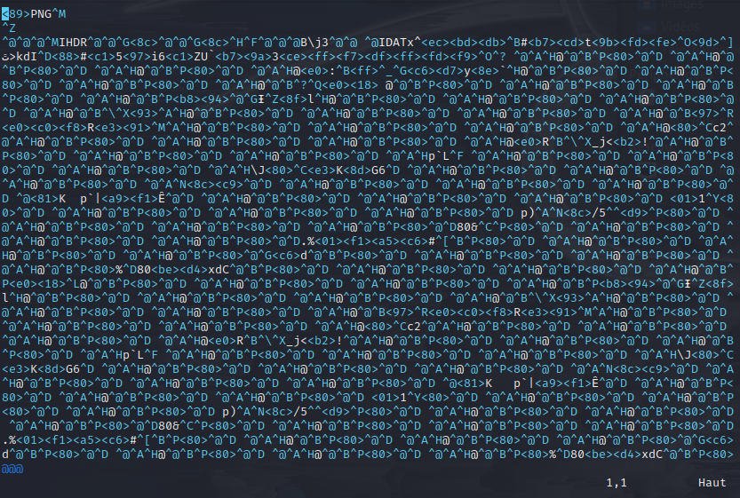

## Challenge “Le Mystère du roman d'amour” 520 résolutions :

**Ennoncé :**
>Author: mh4ckt3mh4ckt1c4s#0705
>
>En train de faire les cent pas dans un couloir du café se trouve Joseph Rouletabille. Il est préoccupé par un mystère des plus intrigants : une de ses amies, qui écrit régulièrement des livres passionnants, a perdu le contenu de son dernier roman !! Elle a voulu ouvrir son oeuvre et son éditeur a crashé... Il semblerait qu'un petit malin a voulu lui faire une blague et a modifié ses fichiers. Elle n'a pu retrouver qu'un seul fichier étrange, que Joseph vous demande de l'aider à l'analyser afin de retrouver son précieux contenu et de comprendre ce qu'il s'est passé.
>
>Vous devez retrouver :
>
> - le PID du processus crashé
> - le chemin complet vers le fichier en question (espaces autorisés) : la forme exacte trouvée dans le challenge et la forme étendue commençant par un / permettent toutes les deux de valider le challenge
> - le nom de l'amie de Rouletabille
> - le nom de la machine
> - le contenu TEXTUEL du brouillon de son livre (si vous avez autre chose que du texte, continuez à chercher : vous devez trouver un contenu texte qui ressemble clairement au début d'un roman). Une fois ce contenu trouvé, il sera clairement indiqué quelle partie utiliser pour soumettre le flag (il s'agira d'une chaîne de caractères en leet)
> - Le flag est la suite de ces éléments mis bout à bout, et séparés par un tiret du 6 (-), le tout enveloppé par 404CTF{...}.
>
>Un exemple de flag valide :
>
>404CTF{1234-/ceci/est/un/Chemin avec/ des espaces1337/fichier.ext-gertrude-monPcPerso-W0w_Tr0P_1337_C3_T3xt3}
>
>Format : 404CTF{PidDuProcessusCrashé-chemin/vers le/fichier-nomUser-nomDeLaMachine-contenuDuFichier}

Pour ce challenge, nous avons un fichier `.swp`. Avec une rapide recherche internet, on se rend compte qu'il s'agit d'un fichier d'échange créé par l'éditeur de texte Vi pour stocke la version de récupération d'un fichier en cours de modification dans le programme. On peut dans un premier temps faire un `file` sur le fichier.

Nous avons donc déjà un très grand nombre d'information pour le flag.
- le PID du processus crashé : 168
- le chemin complet : ~jaqueline/Documents/Livres/404 Histoires d'Amour pour les bibliophiles au coeur d'artichaut/brouillon.txt
- le nom de l'amie de Rouletabille : jaqueline
- le nom de la machine : aime_ecrire

Il ne nous manque plus que le contenue du fichier. Pour cela il existe un moyen de restaurer ce genre de fichier avec la commande `vi -r fichier`

Au vu de la première ligne, il s'agit d'une image. Pour récuperer cette image il suffit de faire `:w file_name` (pour sortir de vi il faut faire :q!). Nous avons donc notre image.

Il se peux qu'il y ait des informations caché, nous allons donc faire un petit tour sur https://aperisolve.fr/.

On y voit clairement un QRCode. Pour lire son contenu on se rend sur https://products.aspose.app/barcode/fr/recognize/qr et nous obtenons :

>Il était une fois, dans un village rempli d'amour, deux amoureux qui s'aimaient...
>
>Bien joué ! Notre écrivaine va pouvoir reprendre son chef-d'oeuvre grâce à vous !
>Voici ce que vous devez rentrer dans la partie "contenu du fichier" du flag : 3n_V01L4_Un_Dr0l3_D3_R0m4N

Notre flag est donc 404CTF{168-~jaqueline/Documents/Livres/404 Histoires d'Amour pour les bibliophiles au coeur d'artichaut/brouillon.txt-jaqueline-aime_ecrire-3n_V01L4_Un_Dr0l3_D3_R0m4N}