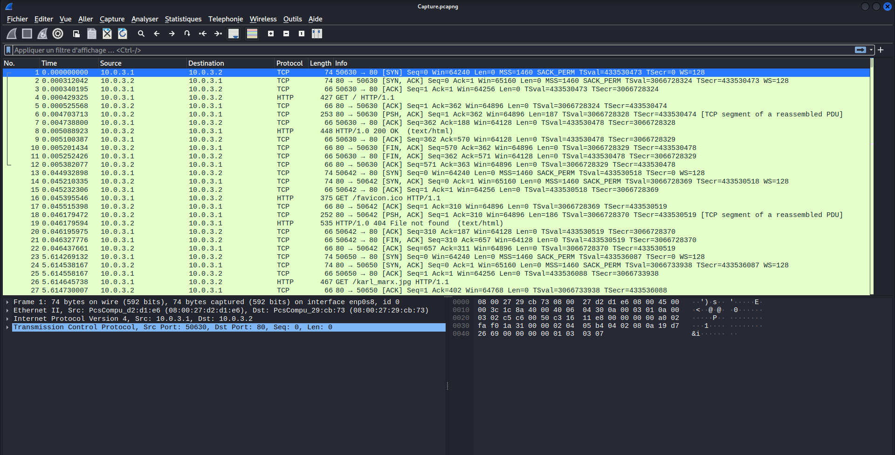
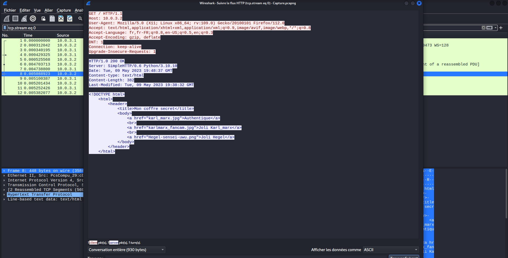
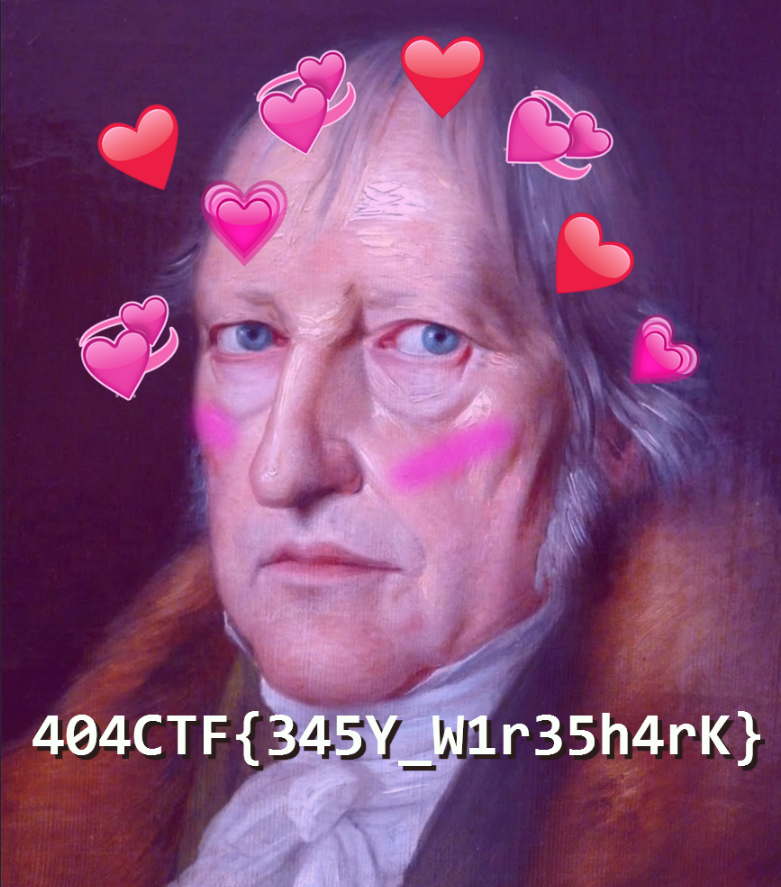

## Challenge “Pêche au livre” 1072 résolutions :

**Ennoncé :**
>Author: Direshaw#6811
>
>Etant tranquillement assis au café littéraire, vous entendez Albert Camus discuter avec quelqu'un d'autre.
>
>Vous comprenez qu'après avoir écrit son dernier livre, il s'interroge sur l'actualité du monde littéraire. Il fait donc des recherches sur ses homologues écrivains et plus particulièrement sur Simone Weil, dont il a beaucoup entendu parlé ces derniers jours, et se demande quel sera le sujet de son prochain livre...
>
>Justement, vous avez récemment intercepté des communications de Simone Weil, peut être pourrez vous trouver le sujet de son prochain ouvrage.
>
>Toutes les informations nécessaires à la résolution de ce challenge sont présentes dans l'énoncé ci-dessus.

Nous avons accès un fichier `.pcapng`. C'est donc une capture de paquets de données sur un réseau. Pour l'ouvrir nous allons utiliser le logiciel **Wireshark**.

Nous avons donc un très grand nombre de paquets. On vient donc dans un premier temps filtrer les résultats en suivant les flux http.

On voit que Simone Weil à regarder plusieurs images. Afin de les rendrent visiblent, on va venir les exporter. Pour cela il suffit de faire `Fichier --> Exporter Objets --> http` et on viens tous les enregistrer.

Nous avons donc plusieurs fichier dont un qui contient le flag.

