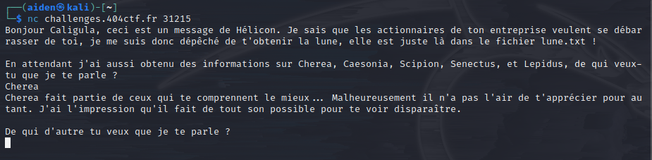
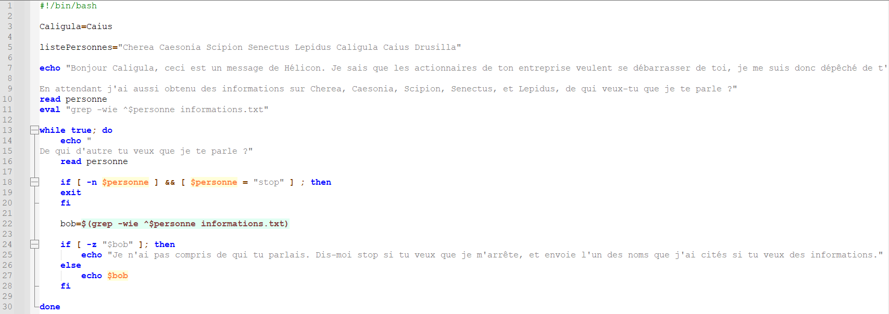
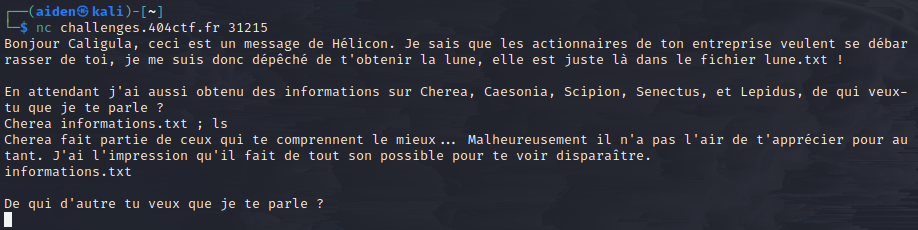
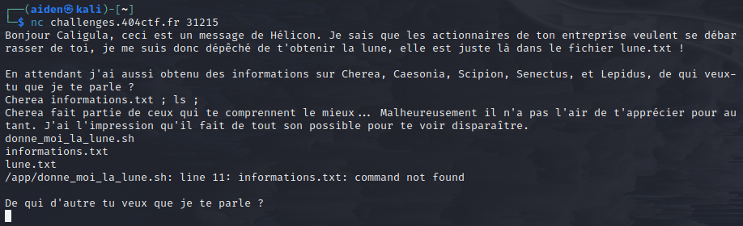
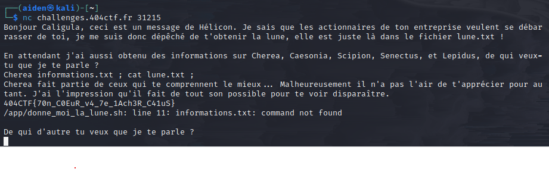

## Challenge “Je veux la lune !” 527 résolutions :

**Ennoncé :**
>Author: chlmine#0024
>
>Caligula est assis seul devant une table du café. Il y a devant lui 5 tasses vides empilées, et une 6e qu'il sirote lentement, ainsi qu'un ordinateur qu'il regarde fixement. Des cernes profonds creusent son visage. Il lève des yeux étonnamment vifs vers vous alors que vous vous approchez de lui.

>Il tend sa main vers son écran d'un air désespéré et s'exclame « Je ne peux plus vivre comme ça, ce monde n'est pas supportable. J'ai besoin de quelque chose de différent. Quelque chose d'impossible, peut-être le bonheur, ou peut-être la lune... Et je sens que ma quête s'approche de sa fin. »

>Vous regardez son écran, et voyez qu'il tente d'accéder sans succès à un fichier.

>« Vous pensez que je suis fou, mais je n'ai jamais pensé aussi clairement ! » Un calcul rapide vous informe qu'il a probablement consommé plus d'un litre de café, et il n'est que 13h. Vous acquiescez lentement. Il reprend « Regardez, Hélicon m'a enfin rapporté la lune, mais il ne m'a pas donné l'accès... le fourbe. Je brûlerai un quart de sa fortune plus tard pour le punir. Aidez-moi ! »

>Entre peur et pitié, vous décidez de l'aider à obtenir le contenu du fichier secret.
>nc challenges.404ctf.fr 31215

### Récupération des fichiers

Nous avons accès à un réseau distant. Nous allons donc dans un premier temps le lancer et voir ce qu'il fait.

Bon, a première vu rien de bien exeptionelle. Passons à présent au fichier `.sh` qui est à notre disposition.

Ici on peut y voir quelque chose d'extremement interessant. Cette ligne : **bob=$(grep -wie ^$personne informations.txt)**
En effet, certes cette ligne a pour but premier de rechercher dans le texet `information.txt`, la saisie utilisateur. Mais on peut très bien s'en servir pour détourner ce service. En effet, **$(command)** permet d'exécuter la commande. Il n'y a aucune vérification de la saisie utilisateur.
Si on essaie une simple **injection de commande** : **Cherea informations.txt ; ls**

Bingo !
Rapide explication de ce qu'il s'est passé. Lorsque nous rentrons la commande **Cherea informations.txt ; ls**, la commande exécuté sera : **bob=$(grep -wie ^Cherea informations.txt ; ls informations.txt)**
Concrétement, on vient faire la commande basique dont le programme est prévu pour, grep -wie ^Cherea informations.txt. Mais on ajoute ensuite une nouvelle commande : ls informations.txt qui vient afficher les informations sur le fichier.

Nous venons donc de détecter notre faille. Seulement ici, connaitre des informations sur le fichier nous importe peut.
Sur le même principe, on va venir rentrer cette commande : **Cherea informations.txt ; ls ;**.
Il va se passer 3 choses. Premièrement l'exécution basique de la commande **grep -wie ^Cherea informations.txt**, puis l'exécution de la commande **ls**, qui va venir lister tout les fichier présent dans le répertoire actuelle et enfin une erreur car **informations.txt** n'est pas considerer comme une commande valide.

On peut y voir un autre fichier nommé `lune.txt`. Très bien, allons voir son contenu.

