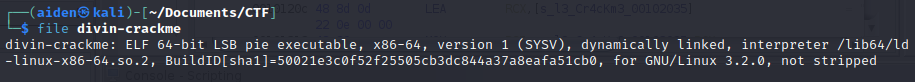
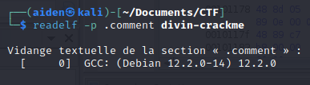
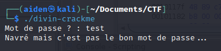
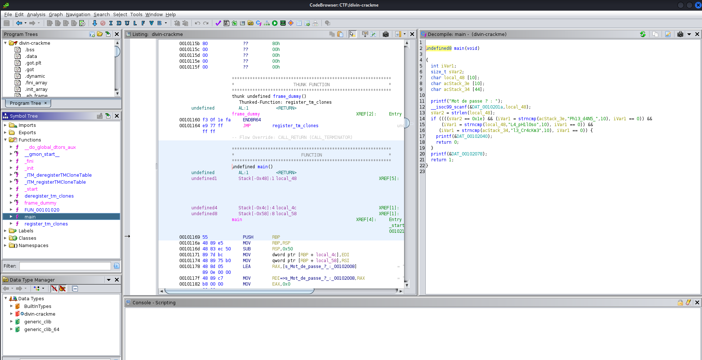

## Challenge “Le Divin Crackme” 509 résolutions :

**Ennoncé :**
>Author: Lowengeist#9608
>
>Jean-Jacques Rousseau vous prend à part : « J'ai déjà raconté la fois où j'ai rencontré le Marquis de Sade ? Non ? Tu en as de la chance... Mes amis avaient plannifié une entrevue entre lui et moi en ville. Avant même de lui parler, il me paraissait étrange. Quoique l'air bien à l'aise, les premiers mots qu'il prononça furent 'Me feriez vous le plaisir de jouer en ma compagnie ?'. Malgré sa demande, j'avais comme l'impression de ne pas vraiment avoir le choix et, en effet, avant de pouvoir lui répondre il poursuivit 'Voici ce que nous allons entreprendre : Vous trouvez mon mot de passe et vous voilà libre. Autrement, je ne réponds plus de rien.'.
>
>Tandis que je m'essayais à son drôle jeu, il me présentait ses points de vue sur les institutions, et, bien que je partage ses opinions sur la nécessité d'accepter l'humain le plus naturel, laissant la corruption des mœurs installée par les institutions derrière nous, je restais critique face à ses aspects les plus libertins... »
>
>« Il serait malvenu de te raconter ce qui se passa par la suite considérant mon échec, mais je suis curieux, aurait tu réussi, toi ? Essaye donc, tu ne risques rien en ce qu'il te concerne ! Pour vérifier que tu ne m'as pas répondu au hasard, j'aimerais que tu me précises avec quel programme le binaire a été compilé ainsi que la fonction spécifique qui est utilisée pour tester le mot de passe. »
>
>Format : 404CTF{compilateur:fonction:mot_de_passe} | tout en minuscules sauf le mot de passe

### Récupération du compilateur

Nous avons ici un fichier exécutable. Essayons d'en savoir un peu plus dessus grâce à la commande `file`.

Bon, visiblement il s'agit d'un exécutable avec une architecture **ELF x86-64**. Malheureusement, le nom du compilateur utilisé n'est pas visible. Nous allons donc essayer une nouvelle commande. `readelf -p .comment divin-crackme`, `readelf` va permettre d'afficher des informations suplémentaire sur le fichier, `-p .comment` va permettre de spécifier une section en particulier, ici ce sera la section commentaire. Il peut contenir l'informations que l'on cherche.

C'est parfait, nous avons donc le compilateur utilisé. Maintenant exécutons le pour voir ce qu'il fait.

### Recupération du mot de passe

On cherche donc un mot de passe. On se munit donc de **Ghidra** et on ouvre la fonction **main**.

On vient donc stocker dans la variable `local_48` la saisie utilisateur. Ensuite on constate un `if` qui se sert de la fonction `strncmp`. Cette fonction retourne 0 si les deux chaines de caractères sont égales sinon elle renvoie 1. On voit que la variable `local_48` est décalré en premier, puis `acStack_3e` et enfin `acStack_34`. Donc elle se succéderont dans la mémoire. Le premier `strncmp` vient donc lire les 10 premiers caractères à la position `local_48`, puis les 10 premier à la position `acStack_3e` et enfin les 10 suivant à `acStack_34`. le mot de passe sera donc L4_pH1l0soPh13_d4N5_l3_Cr4cKm3.

Notre flag sera donc 404CTF{gcc:strcmp:L4_pH1l0soPh13_d4N5_l3_Cr4cKm3}