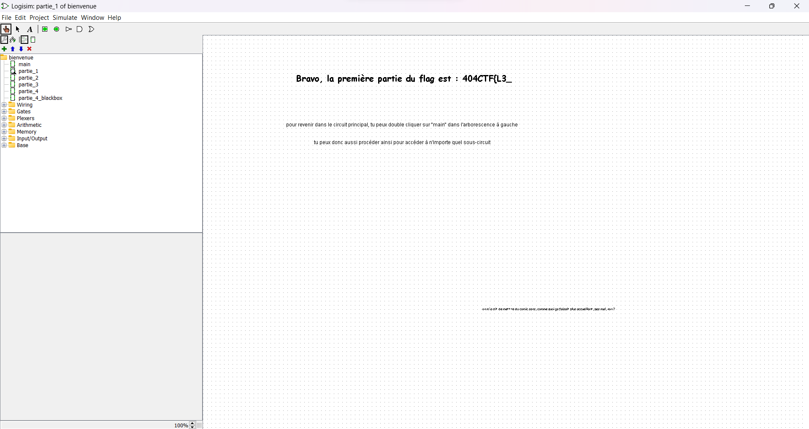

## Challenge “Un courrier suspect” 336 résolutions :

**Ennoncé :**
>Author: Jauttaro Coudjau#0911
>
>Vous commencez à profiter de la vue offerte par ce café pittoresque ainsi que de vos premières gorgées de café quand vous sentez une présence derrière vous.
>
>« Bienvenue, novice. Moi c'est Jean Paul Sartre, mais on m'appelle plutôt Jean Paul Sat par ici. »
>
>À peine avez vous eu le temps de vous retourner, que cet individu vous met dans les mains une platine sur laquelle figure un circuit. Il vous tend également une petite feuille, qui parle d'un "test de remise à niveau".
>
>« Et voici les instructions. »
>
>Il vous regarde avec insistance.

### Partie 1
On a a notre disposition un fichier `.circ`. Avec une rapide recherche internet on tombe sur ce logiciel pour lire ce genre de fichier. https://sourceforge.net/projects/circuit/.

Lorsque l'on ouvre le fichier on obtient cela :

Les instructions sont très claires, lançons donc la première partie :

Nous avons donc la première partie de notre flag. Passons donc à la partie suivante.

### Partie 2

Les instructions sont encore une fois très claires, il suffit donc de changer la clock. Nous obtenons la suite en héxadécimal suivante : 4d306d3363545f3353745f563363555f
Afin de décoder cette chaine, on peut très bien trouver un convertisseur en ligne, mais le fichier nous le fournit.

Notre flag est donc pour l'instant 404CTF{L3_M0m3nT_3St_V3cU_

### Partie 3
A présent passons à la dernière partie.

Si on essaie de changer la clock, il n'y a aucun changement. Mais il y a une indication, qui est que l'on peux modifier le circuit. On vient donc juste supprimer la porte And.

On obtient alors 44335f35346d757333727d0000000000
Le flag est donc 404CTF{L3_M0m3nT_3St_V3cU_D3_54mus3r}