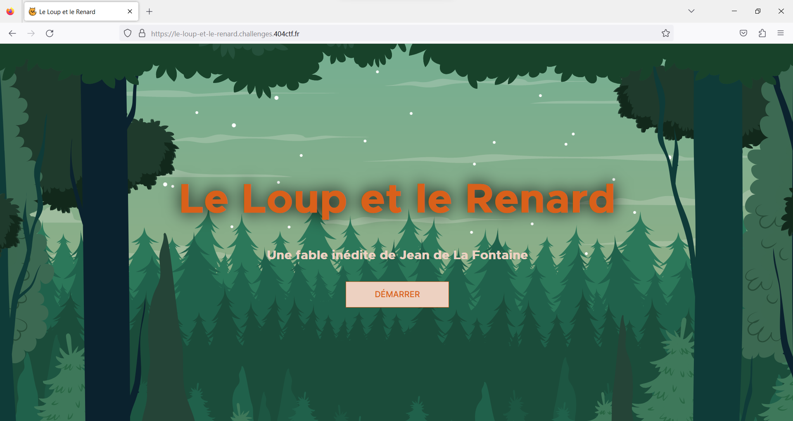
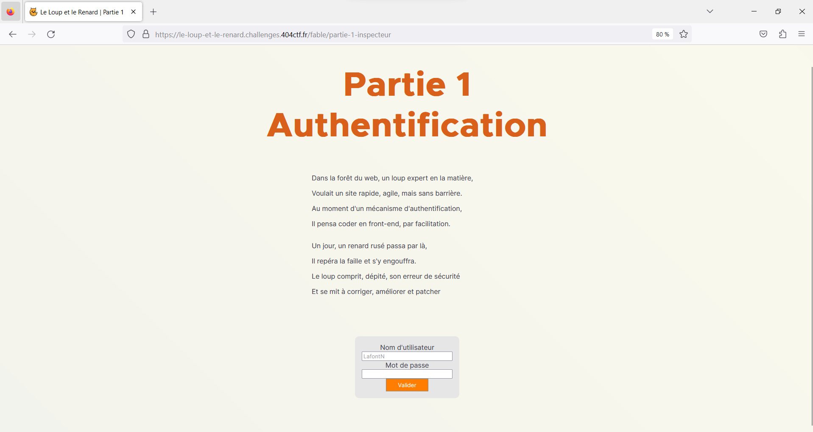
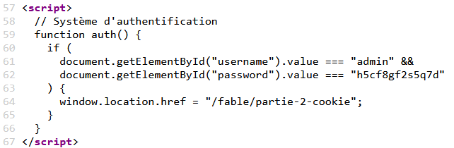
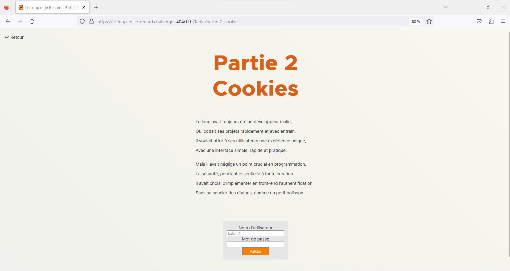
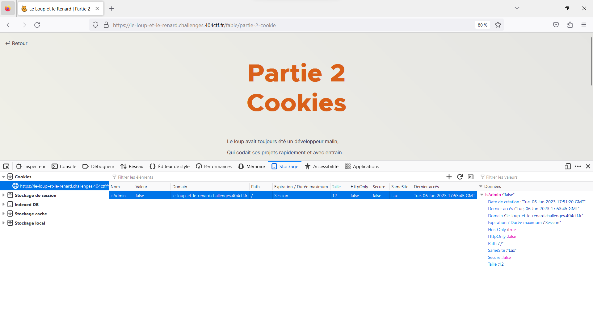
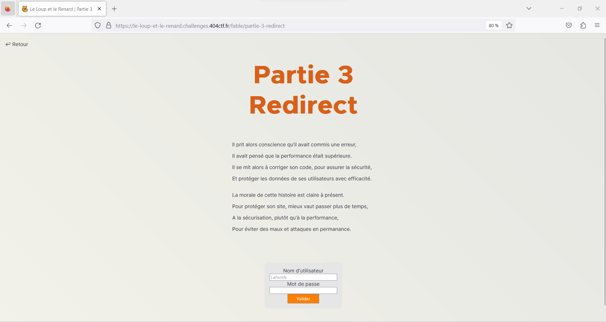

## Challenge “Le Loup et le renard” 1136 résolutions :

**Ennoncé :**
>Author: Artamis#7513 & V0odOo#3248
>
>Dans un coin du café, un homme est assis. Une tasse de café ainsi qu'un manuscrit sont posés devant lui. Il observe la salle : les allées-venues des clients, les conversations. Il semble à l'affût de la moindre action, du moindre écart de la part de son sujet d'observation.
>
>Alors que son regard parcourt la salle, il s'étonne de voir que vous l'observiez déjà. D'un geste accompagné d'un sourire il vous invite à le rejoindre.
>
>« Bienvenue ! Prenez place. Il est rare de voir quelqu'un d'attentif à autre chose que sa propre personne ici. C'est dommage, c'est justement ce qu'il y a de plus intéréssant dans ce genre de rassemblement : les autres. Je me présente : Jean de La Fontaine. Votre regard me plait, vous me semblez capable de m'aider sur mon prochain manuscrit. J'écris, voyez-vous ? Des fables, je m'inspire de ce que je vois et j'observe. Pouvez-vous m'aider à écrire la suite de celle-ci ? »
>
>Connection au challenge : https://le-loup-et-le-renard.challenges.404ctf.fr/

### Partie 1

Tout d'abord, accédons au site internet.

Très bien, démarrons.

Aprioris l'objectif est donc de se connecter. Pour essayer, on peut rentrer `admin` et `admin`. Rien ne se passe. Allons faire un tout du coté de **l'inspecteur**. (pour avoir tout le code de la page il est possible de faire CTRL + U). On y trouve une partie intéressante.

Essayons donc avec `admin` et `h5cf8gf2s5q7d`.

### Partie 2

On dirais bien que cela à fonctionné. Un nouveau challenge est à notre disposition et au vu du titre, cela à un rapport avec les **cookies**. Si on viens faire un tour dans la partie **stockage**, on observe un **cookie de session**.

On voit très distinctement qui nous ne somme pas admin. Très bien. Changons alors la valeur `false` par `true` et rechargons la page.

### Partie 3

Rien de bien compiqué au final. Pour ce nouveau petit challenge, le titre nous donne un gros indice. En effet, il est question de redirection. En effet si l'on presse sur validé on peut voir qu'il se passe quelque chose. Lors de l'appuie sur le boutton nous somme alors redirigé vers une page. Or comme le nom d'utilisateur et le mot de passe sont les même, il ne se pas rien.
Enfin, pas vraiment. Il existe ne nombreuses méthodes pour intercepter une redirection, par exemple avec `curl` ou bien encore `burpsuite`, mais la technique la pluis simple est d'appuier sur le boutton `échap` juste après l'appuie sur le boutton validé.

Et le flag s'offre à nous.