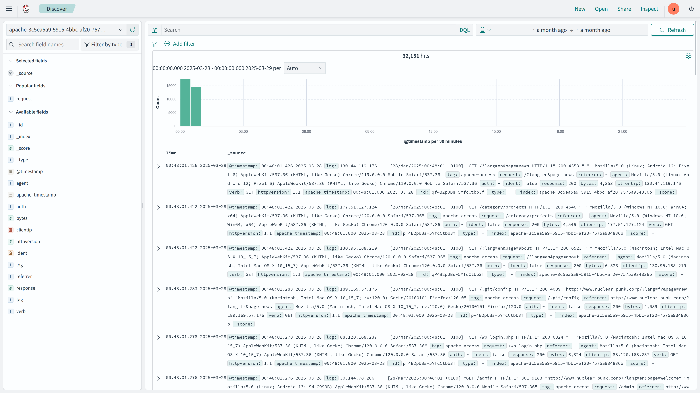
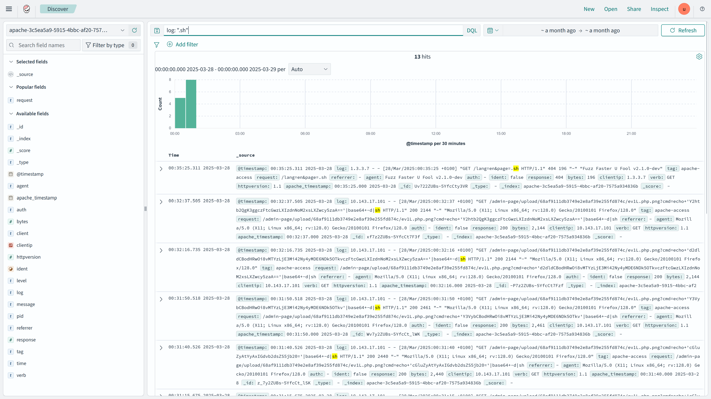
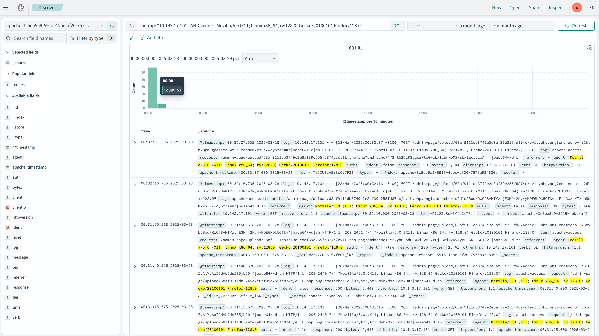
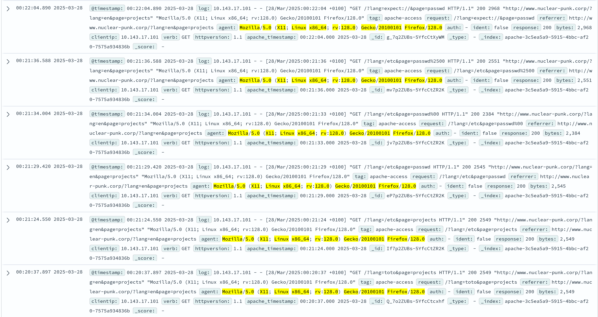
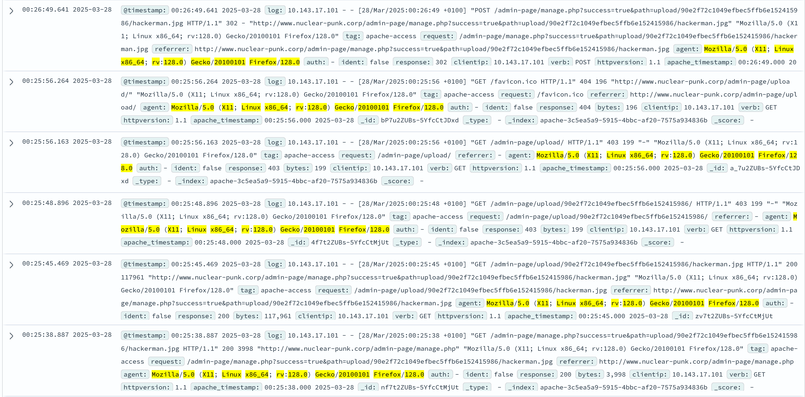
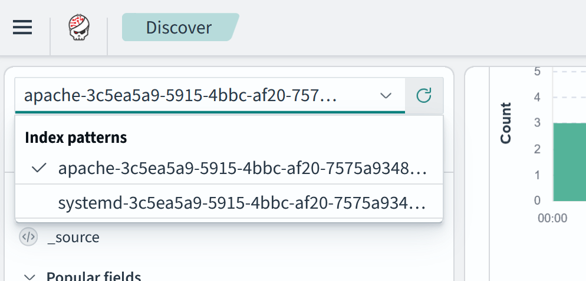
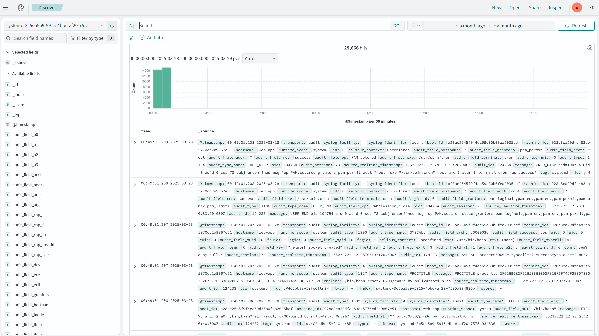

# Mission 2 :

 

> **Brief de mission**  
> L'organisation alliée Nuclear Punk ayant subi une attaque par l'entité nous a fourni ses logs afin de nous aider à comprendre les techniques utilisées par les attaquants.
>
> Pour identifier le groupe attaquant, vous devez récupérer le CWE de la première vulnérabilité utilisée par l'attaquant, le CWE de la seconde vulnérabilité utilisée par l'attaquant, l'adresse IP du serveur sur lequel l'attaquant récupère ses outils ainsi que le chemin arbitraire du fichier permettant la persistance.
>
> Exemple de données :
> - CWE de la première vulnérabilité : SQL Injection -> CWE-89 ;
> - CWE de la seconde vulnérabilité : Cross-Site Scripting -> CWE-79 ;
> - IP : 13.37.13.37 ;
> - Chemin du fichier : /etc/passwd ;
>
> Format de validation : RM{CWE-89:CWE-79:13.37.13.37:/etc/passwd}

> **Objectifs de la mission**  
> Analyser les logs via le SOC.
> Identifier des indicateurs de compromission (IoC) et des indicateurs d'attaque (IoA).

## Analyse

Nous avons accès à un lien vers un site internet. Commençons par l'analyser.

  

Il s'agit ici d'une vue Discover de Kibana. C'est un module qui, dans notre cas, permet de stocker des logs d'un serveur Apache. Nous devons donc analyser ces logs afin de retrouver des informations sur l'attaquant.

## Identification de l'attaquant

Pour commencer, on peut se dire que l'attaquant a voulu uploader et exécuter, par un quelconque moyen, un fichier. Essayons de chercher tous les `.sh`.

  

C'est une plutôt bonne nouvelle. Visiblement pas de fichier `.sh` mais plutôt des injections de commandes. On voit plusieurs lignes peu communes, notamment cette requête `GET /admin-page/upload/68af9111db3749e2e8af39e255fd874c/ev1L.php.png?cmd=echo+'Y2htb2QgK3ggczFtcGwzLXIzdnNoM2xsLXZwcy5zaA=='|base64+-d|sh`.

Rien qu'au nom du fichier `ev1L.php` on peut se douter que c'est notre attaquant. De plus, la chaîne encodée en base64 correspond à `chmod +x s1mpl3-r3vsh3ll-vps.sh` ce qui ne fait que renforcer le fait que c'est l'attaquant. C'est très intéressant. Mais ce qui l'est encore plus c'est que nous avons l'adresse IP du client, donc de notre attaquant. Avec un filtre sur cette IP, cela permet de ne voir que les requêtes faites par cette personne. Il reste possible que l'attaquant change son IP durant son attaque mais cela reste une piste assez solide à vérifier. Mais le problème, c'est qu'avec ce filtre, il reste 5 000 requêtes à analyser, ce qui est beaucoup trop. Mais si on regarde rapidement, on constate qu'il y a des requêtes avec des user agents spéciaux, par exemple `vxstxt1on-t00ling` qui n'est pas un agent normal. C'est probablement un outil automatisé, genre un scanner. Ici on va dans un premier temps s'intéresser à ce qu'a fait manuellement l'attaquant. Donc on va ajouter à ce filtre, son user agent `Mozilla/5.0 (X11; Linux x86_64; rv:128.0) Gecko/20100101 Firefox/128.0`.

  

Cela nous réduit à une cinquantaine de requêtes.

## Récupération des CWE

Nous cherchons donc les deux attaques qu'il a utilisées. Pour cela, il suffit de lire toutes ses requêtes en partant de la première. Au début il a des agissements basiques, il visite le site web normalement, il fait des requêtes `GET /?lang=en&page=projects HTTP/1.1`. Rien d'alarmant. Puis on commence à voir l'arrivée des premières tentatives.

  

L'attaquant essaie d'injecter des wrappers spéciaux (php://, data://, expect://) ou des chemins comme /etc dans le paramètre lang. En clair, il tente de forcer l'inclusion d'un fichier arbitraire ou d'exécuter du code malicieux via les flux PHP. Nous avons donc notre première CWE, **CWE-98: Improper Control of Filename for Include/Require Statement in PHP Program ('PHP Remote File Inclusion')**.

Puis, toujours en remontant les logs, on constate la seconde tentative d'exploitation (que nous avons déjà plus ou moins vue plus haut avec cette requête `GET /admin-page/upload/68af9111db3749e2e8af39e255fd874c/ev1L.php.png?cmd=echo+'Y2htb2QgK3ggczFtcGwzLXIzdnNoM2xsLXZwcy5zaA=='|base64+-d|sh`).

  

Il s'agit de l'upload d'un fichier malveillant qui correspond à la CWE **CWE-434: Unrestricted Upload of File with Dangerous Type**.

## Récupération de l'adresse IP

Maintenant intéressons-nous à l'adresse IP sur laquelle il va chercher ses outils. Attention, on pourrait penser qu'il s'agit de `10.143.17.101` mais pas forcément. C'est certes son adresse IP, mais pas forcément celle où il va chercher ses outils. Si on se rappelle bien, au début, on a trouvé une requête qui exécutait cette commande `chmod +x s1mpl3-r3vsh3ll-vps.sh`. Il s'agit donc très probablement de l'outil qu'il a téléchargé. On voit que cette commande a été exécutée via le paramètre `cmd`. Cherchons donc toutes les requêtes qui contiennent ce paramètre.

Cela nous ressort que 8 requêtes qui ont chacune une commande en base64. Si on les décode toutes, on obtient cette chronologie :

  

Et nous avons donc l'adresse IP où sont récupérés les outils, qui est bien différente de celle de l'attaquant : 163.172.67.201.

## Récupération du fichier permettant la persistance

Pour trouver ce chemin d'accès, nous ne trouverons rien dans les logs Apache. Il s'agit juste de requêtes web. On peut voir que l'attaquant upload un fichier ou encore exécute du code mais c'est tout. En revanche, depuis le début, dans Kibana, nous sommes dans l'unique section Apache.

  

On constate que nous avons également accès au pattern `systemd` qui est bien plus intéressant pour chercher un chemin d'accès car il s'agit des logs système du serveur, donc des processus démarrés, un cron job, etc.

  

Et effectivement, sans même avoir à appliquer de filtre, on constate `cmdline: /bin/bash /root/.0x00/pwn3d-by-nullv4stati0n.sh`. Nous avons donc un fichier qui est exécuté et qui a un nom très suspect. Il s'agit bien de l'attaquant.

## Récupération du flag

Nous avons donc toutes les informations qu'il faut pour avoir le flag : RM{CWE-98:CWE-434:163.172.67.201:/root/.0x00/pwn3d-by-nullv4stati0n.sh}
