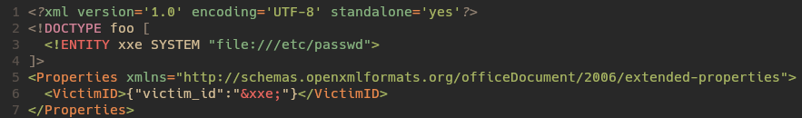
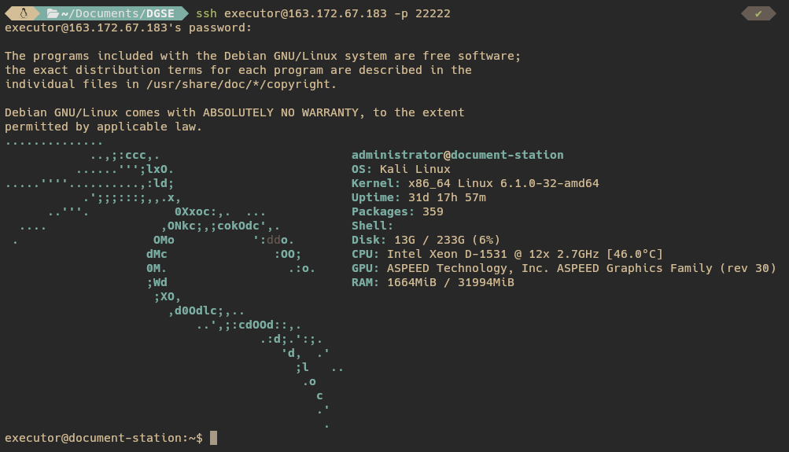

# Mission 4 :


<br>

> **Brief de mission**  
> L'une de vos équipes de renseignement a réussi à identifier une application qui fait partie de la chaîne d'attaque de l'entité.

> **Objectifs de la mission**  
> Réaliser une intrusion sur l'application web hébergée par le serveur attaquant.
> Récupérer les plans d'attaque de l'entité.

## Analyse

Nous avons accès à une simple adresse IP et c'est tout. Commençons par l'analyser.

La première étape est assez basique, un simple nmap pour savoir ce qui est ouvert sur cette machine.

<p align="center">
  
</p>

On y voit deux choses intéressantes ici. Dans un premier temps, la machine possède un serveur web. Mais elle possède également un serveur SSH qui a été volontairement déplacé (le port de base étant 22), probablement pour essayer d'échapper à des scans de ports basiques.

Nous n'avons pour l'instant aucun moyen d'accès via SSH car nous n'avons pas d'identifiants. Intéressons-nous dans un premier temps au site web pour voir s'il n'est pas possible d'en ressortir quelque chose.

<p align="center">
  
</p>

Visiblement, on peut sélectionner un fichier (un docx) qui va nous générer un nouveau fichier. Et si ce nouveau fichier est uploadé via le second formulaire, on voit qu'il a un ID.

## Analyse du DOCX

Visiblement, une chose a changé dans notre fichier. Pour comprendre ce qui a été ajouté, il faut savoir qu'un docx est en réalité juste une archive ZIP qui contient plusieurs fichiers. Nous allons donc extraire le fichier initial et le fichier modifié afin d'en déterminer la ou les différences.

<p align="center">
  
  <br>
  
</p>


Une seule chose est différente : c'est le fichier `docProps/app.xml` qui contient une balise supplémentaire `<VictimID></VictimID>`.

## Exploitation du site web

Je suis longtemps resté sur une fausse piste à cause du fichier `script.js` accessible dans le débogueur qui contient une XSS. Mais, après avoir fait un exploit fonctionnel et ne comprenant pas comment elle pouvait m'être utile, je me suis plus intéressé à des vulnérabilités en lien avec des fichiers XML (étant donné que c'est ce fichier que nous pouvons manipuler). Et la vulnérabilité la plus connue qui revient, c'est **XXE : XML External Entity**.

Cette attaque survient si un attaquant peut uploader un XML modifié. Si le serveur parse mal le XML, nous pouvons lire n'importe quel fichier du serveur (cf. [ce site](https://www.vaadata.com/blog/fr/comprendre-les-vulnerabilites-web-en-5-min-episode-11-xxe/)).

C'est donc un exploit à essayer.

Il suffit de modifier le fichier `docProps/app.xml` et de compresser les fichiers pour le remettre au format docx.

<table>
<tr>
<td>

<br>

</td>
<td>

</td>
</tr>
</table>


C'est parfait, nous pouvons donc maintenant lire n'importe quel fichier du serveur.

Tout d'abord, le fichier `/etc/passwd` nous apprend de précieuses choses. Il y a 4 utilisateurs : root, administrator, executor et document-user. Cela nous sera peut-être utile pour nous connecter en SSH si on obtient un mot de passe ou une clé SSH.

Ici, vu les utilisateurs disponibles, il y a de fortes chances que nous soyons document-user, mais on peut le vérifier en lisant `proc/self/status` pour obtenir notre UID.

<p align="center">
  
</p>

Maintenant, que chercher ? Une chose qui peut être intéressante, c'est l'historique des commandes de notre utilisateur, on peut peut-être obtenir des informations sur des fichiers intéressants.

<p align="center">
  
</p>

C'est absolument parfait, nous avons pas mal d'informations intéressantes ici. Voici les commandes de manière plus lisible :

```bash
id
htop
cat /etc/passwd
sudo su
ps aux | grep python
rm -rf /tmp/*
ip --brief --color a
whoami
uname -a
cat /plans/next-op.txt                                                           # <-- Ici
ls /var/log/
vim .bashrc
ls -la
cd /app
python3 app.py
pip install -r requirements.txt
export FLASK_ENV=production
flask run --host=0.0.0.0 --port=5000
echo "cABdTXRyUj5qgAEl0Zc0a" >> /tmp/exec_ssh_password.tmp                       # <-- Ici
ps aux | grep flask
cd templates/
vim index.html
vim app.py
export SECRET_KEY=$(head -n50 /dev/null | xxd | sha256sum | awk '{print $1}')    # <-- Ici
grep -RiF "docx" .
ls -la /tmp/
vim README.md
clear
ls -lah /tmp
exit
vim /etc/hosts
```

Premièrement, une chose saute aux yeux : le fichier `/plans/next-op.txt`. Malheureusement, ce n'est pas si simple, le fichier n'existe plus ou a été déplacé ultérieurement. Ensuite, deux choses attirent l'attention : nous avons une chaîne de caractères qui est stockée dans `/tmp/exec_ssh_password.tmp` ainsi que la variable SECRET_KEY. Mais si on regarde plus en détail, SECRET_KEY ne sert pas à grand-chose, cela sera égal à l'empreinte SHA256 du vide qui vaut `e3b0c44298fc1c149afbf4c8996fb92427ae41e4649b934ca495991b7852b855`. C'est possible que ce soit utile mais peu probable. Mais surtout, nous avons un possible mot de passe pour une connexion SSH.

## Exploitation du serveur

### Escalade de privilège

C'est parfait, il suffit d'essayer ce mot de passe avec tous les comptes disponibles.

Et finalement, après les avoir tous essayés, nous avons un accès SSH sur le serveur.

<p align="center">
  
</p>

C'est une très bonne chose, mais malheureusement on va vite se rendre compte que notre accès est assez limité : on ne peut même pas écrire dans un fichier. Idéalement, il nous faudrait un accès plus haut, donc une escalade de privilège.

Et par chance, malgré notre accès très limité, nous avons la possibilité d'exécuter une commande en tant qu'administrator.

<p align="center">
  
</p>

Maintenant, est-il possible d'exploiter ce binaire pour obtenir un shell administrator ? À première vue, il y a plein de commandes externes qui sont exécutées dans ce script, comme par exemple `uname`. Ma première idée fut de faire un simple Path Hijacking et le tour est joué. Seulement, on ne peut écrire nulle part. Donc il faut être plus malin. Si on analyse bien tout le code, on voit qu'il y a une option assez intéressante, l'option -o.

<p align="center">
   <br/>
   
</p>

Ici, on vient stocker tout ce qu'il y a après l'option dans la variable overrideDisplay, et cette variable va directement être exécutée avec `eval`. Donc si on met `-o 'bash'`, on obtient un shell.

<p align="center">
  
</p>

### Exfiltration des données et récupération du flag

C'est parfait, nous avons maintenant un compte avec plus de droits. Maintenant, que chercher ? Essayons simplement de regarder ce que contient son home.

<p align="center">
  
</p>

Nous avons 2 fichiers, dont un particulièrement intéressant, un `.kdbx`. Ces fichiers sont des fichiers KeePass (gestionnaire de mots de passe). Exfiltrons-les. J'ai la flemme d'ouvrir un port SSH sur ma machine, je suis donc passé par `curl`. 0x0.st est un service minimaliste pour uploader rapidement des fichiers ou du texte. Donc avec une simple commande `curl` je peux uploader un fichier et le récupérer avec `wget`.

<p align="center">
  
  <br/>
  
</p>

Maintenant, il ne reste plus qu'à récupérer le mot de passe du KeePass.

<p align="center">
  
</p>

Et si on l'avait déjà ? KeePass a une option très intéressante qui est que l'on peut, non pas utiliser un mot de passe classique, mais un fichier pour chiffrer ses données. Sur le papier, c'est une très bonne idée. Sauf si on laisse ce même fichier traîner au même endroit que le `.kdbx`, un fichier .jpg par exemple.

De cette manière, on récupère facilement l'accès aux mots de passe et on obtient enfin le flag.

<p align="center">
  
</p>