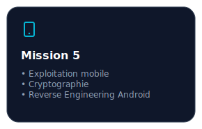

# Mission 5 :

 

> **Brief de mission**  
> Lors d'une arrestation au domicile d'un des attaquants précédemment identifiés, l'équipe a saisi une vieille tablette Google utilisée pour leurs communications.
> Durant son analyse, une application de chat semble être chiffrée, rendant impossible l'accès et la découverte de son contenu.

> **Objectifs de la mission**  
> Analyser l'application mobile.
> Accéder aux informations chiffrées.

## Analyse

Nous avons accès à un `.apk`. Commençons par l'analyser.

  
  

Visiblement, nous avons des messages à déchiffrer, pas besoin d'aller beaucoup plus loin. 

## Analyse de l'APK

Maintenant, nous allons utiliser `jadx-gui` afin de récupérer le code de cette APK. D'après la consigne, on cherche à déchiffrer des messages chiffrés. Très bien, alors cherchons des mots-clés.

  

On voit qu'il y a `decryptMessage = homeViewModel2.decryptMessage(message.getContent());`. Regardons à quoi correspond cette section.

  

On a plusieurs choses intéressantes. Tout d'abord, on voit que les messages sont déchiffrés par une fonction appelée decryptMessage. Et les messages sont récupérés depuis une API. Allons dans un premier temps essayer de récupérer ces messages chiffrés.

Pour ce faire, si on remonte tous les appels de message (qui est la valeur passée en paramètre à decryptMessage), on voit qu'au début il y a `message = RetrofitClient.INSTANCE.apiService.getMessages(hashDeviceId, this)` et que plus loin il y a un `apiResponse.getmessages()`. Regardons plus en détail cela. ApiResponse n'est pas très intéressant. À partir de la réponse d'une requête, il permet de donner les messages bien formatés et si une erreur est survenue. Ce n'est donc pas ici que nous pourrons récupérer les messages. Mais si on regarde RetrofitClient, on a :

   
  

## Récupération des messages chiffrés

Nous avons donc tous les éléments pour récupérer les messages. Nous avons l'IP et un paramètre. Essayons avec une requête. Mais pour cela, il faut, comme nous l'indique ApiService, l'ID d'un appareil. Mais si on retourne au code un peu plus haut, on voit qu'il existe une fonction `hashDeviceID` qui est passée en paramètre à `RetrofitClient.INSTANCE.apiService.getMessages`.

  

Nous savons donc comment générer un ID. Écrivons un petit [script](https://github.com/IAidenI/CTF_WriteUps/blob/master/DGSE%202025/Mission5/Scripts/getID.py) et testons tout cela.

<table align="center">
<tr>
<td align="center" width="50%">
  
</td>
<td width="50%">
  
</td>
</tr>
</table>

Nous avons donc tous les messages chiffrés.

## Récupération des messages en clair

Maintenant, nous pouvons nous concentrer sur comment déchiffrer les messages. Pour ce faire, c'est parfait, nous avons une fonction dans l'APK qui le fait.

  

> *STATIC_IV et STATIC_SALT sont deux variables définies plus haut dont nous connaissons le contenu.*

Parfait, il ne nous reste plus qu'à faire un [script](https://github.com/IAidenI/CTF_WriteUps/blob/master/DGSE%202025/Mission5/Scripts/decrypt.py) qui permet d'automatiser tout cela.

  
  

C'est bien, nous avons bel et bien réussi à déchiffrer des messages. Mais il en manque. En fait, ces 3 messages (qui sont les 3 que l'on voyait au début) seront toujours déchiffrés par cette fonction, peu importe le device/brand fourni. Si on change le device/brand et que l'on tente de récupérer à nouveau les messages, on peut constater qu'ils n'ont pas changé sauf ces 3 messages qui sont différents. Cela veut dire qu'ils sont chiffrés avec l'ID qu'on fournit à l'API, contrairement aux autres qui doivent être chiffrés avec un ID spécifique. Il ne nous reste donc plus qu'à trouver la bonne paire de device/brand.

## Récupération du flag

D'après la consigne, nous avons une information intéressante qui est `l'équipe a saisi une vieille tablette Google`, nous savons donc quoi chercher. Mais cela reste assez vague. J'ai dû chercher de nombreuses heures en vain à tester des combinaisons. J'ai donc décidé de tous les tester. J'ai trouvé ce [github](https://github.com/androidtrackers/certified-android-devices) qui regroupe l'intégralité des appareils Android certifiés. J'ai donc demandé à mon ami chat GPT de me fournir un JSON avec juste device/brand des appareils Google car j'ai la flemme de faire les 500 000 appareils pour ne prendre que ceux qui sont Google et le mettre au bon format, il le fait bien mieux que moi. Avec ce nouveau [script](https://github.com/IAidenI/CTF_WriteUps/blob/master/DGSE%202025/Mission5/Scripts/decrypt_message.py) on obtient le flag

  
  

