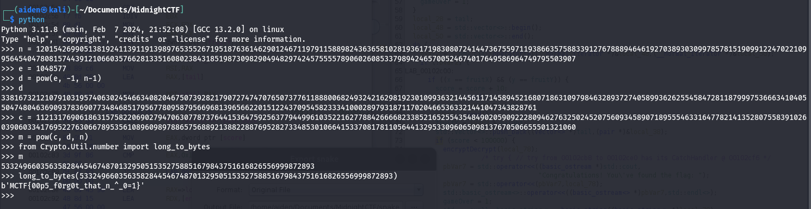

## Challenge “Intro Retour aux sources” XXX résolutions :

**Ennoncé :**
>Author: Artamis#7513 & V0odOo#3248
>
>Dans un coin du café, un homme est assis. Une tasse de café ainsi qu'un manuscrit sont posés devant lui. Il observe la salle : les allées-venues des clients, les conversations. Il semble à l'affût de la moindre action, du moindre écart de la part de son sujet d'observation.
>
>Alors que son regard parcourt la salle, il s'étonne de voir que vous l'observiez déjà. D'un geste accompagné d'un sourire il vous invite à le rejoindre.
>
>« Bienvenue ! Prenez place. Il est rare de voir quelqu'un d'attentif à autre chose que sa propre personne ici. C'est dommage, c'est justement ce qu'il y a de plus intéréssant dans ce genre de rassemblement : les autres. Je me présente : Jean de La Fontaine. Votre regard me plait, vous me semblez capable de m'aider sur mon prochain manuscrit. J'écris, voyez-vous ? Des fables, je m'inspire de ce que je vois et j'observe. Pouvez-vous m'aider à écrire la suite de celle-ci ? »
>
>Connection au challenge : https://le-loup-et-le-renard.challenges.404ctf.fr/

Nous avons accès à deux fichiers. Un fichier qui contient une clé publique RSA ainsi qu'un message chiffré par cette clé, et l'algorithme qui a permis de chiffrer le mot de passe. Dans l'algorithme, on y voit un sérieux problème. En effet, l'utilisateur a décidé de prendre un module premier. La conséquence de cela est que phi, qui normalement équivaut à (p-1)(q-1) ne vaut ici plus que n-1. Très bien, on ressort nos cours sur le RSA et on décode tout ça.

