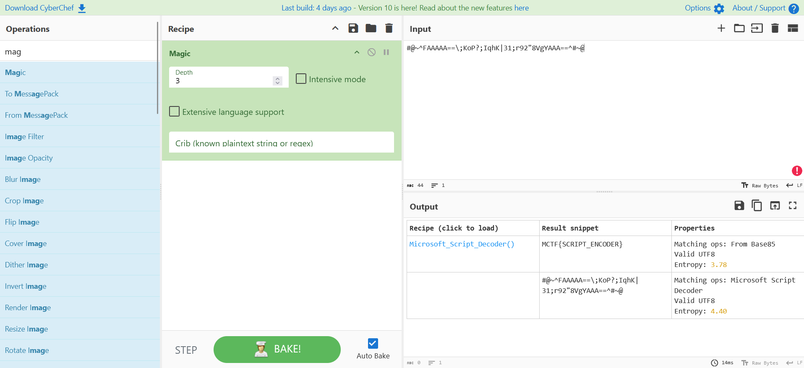

## Challenge “Script Encoder” XXX résolutions :

**Ennoncé :**
>Author: chlmine#0024
>
>Caligula est assis seul devant une table du café. Il y a devant lui 5 tasses vides empilées, et une 6e qu'il sirote lentement, ainsi qu'un ordinateur qu'il regarde fixement. Des cernes profonds creusent son visage. Il lève des yeux étonnamment vifs vers vous alors que vous vous approchez de lui.
>
>Il tend sa main vers son écran d'un air désespéré et s'exclame « Je ne peux plus vivre comme ça, ce monde n'est pas supportable. J'ai besoin de quelque chose de différent. Quelque chose d'impossible, peut-être le bonheur, ou peut-être la lune... Et je sens que ma quête s'approche de sa fin. »
>
>Vous regardez son écran, et voyez qu'il tente d'accéder sans succès à un fichier.
>
>« Vous pensez que je suis fou, mais je n'ai jamais pensé aussi clairement ! » Un calcul rapide vous informe qu'il a probablement consommé plus d'un litre de café, et il n'est que 13h. Vous acquiescez lentement. Il reprend « Regardez, Hélicon m'a enfin rapporté la lune, mais il ne m'a pas donné l'accès... le fourbe. Je brûlerai un quart de sa fortune plus tard pour le punir. Aidez-moi ! »
>
>Entre peur et pitié, vous décidez de l'aider à obtenir le contenu du fichier secret.
>
>Connection au challenge : nc challenges.404ctf.fr 31215

Nous avons accès à un inconnu dont voici le contenu : `#@~^FAAAAA==\;KoP?;IqhK|31;r92"8VgYAAA==^#~@`

Visiblement c'est une sorte de chaîne de caractère encodé. Allons donc faire un tour sur [CyberChef](https://gchq.github.io/CyberChef/) et utilisons l'outil `Magic` qui permet de chercher une correspondance possible parmis ce qu'il connait.
