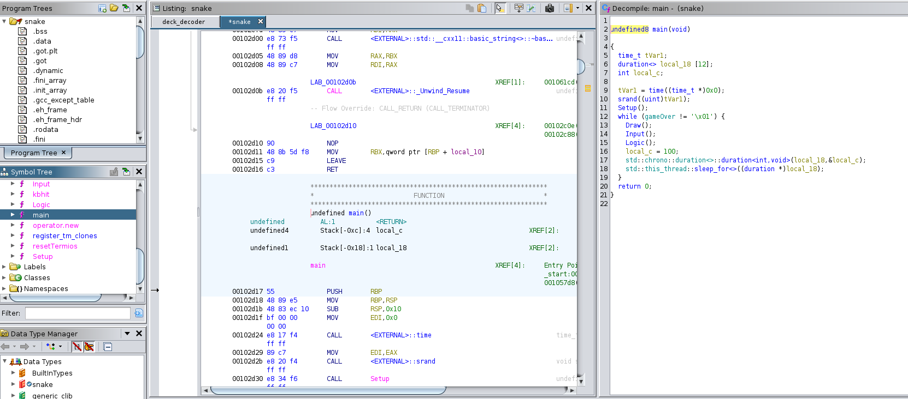
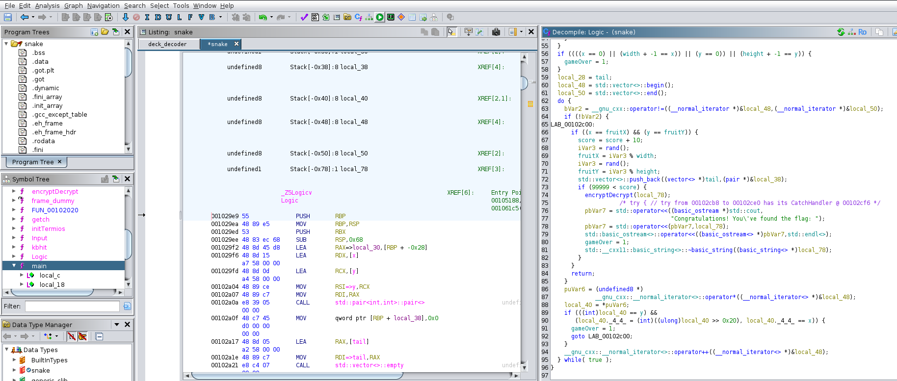
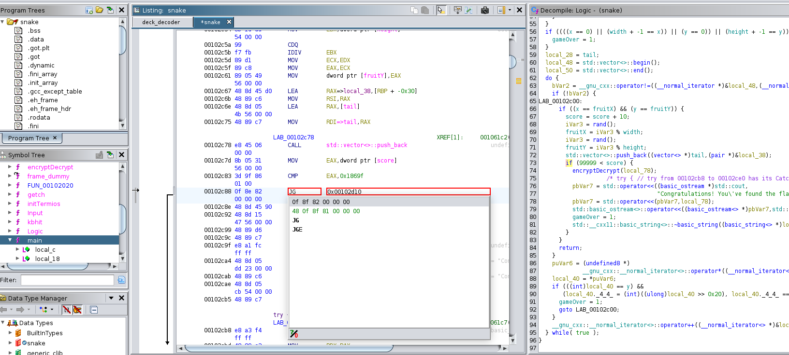
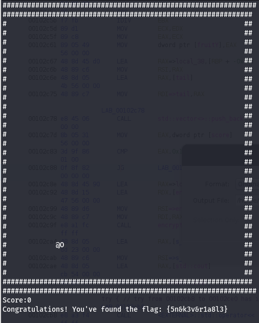

## Challenge “Snake” XXX résolutions :

**Ennoncé :**
>Author: chlmine#0024
>
>Caligula est assis seul devant une table du café. Il y a devant lui 5 tasses vides empilées, et une 6e qu'il sirote lentement, ainsi qu'un ordinateur qu'il regarde fixement. Des cernes profonds creusent son visage. Il lève des yeux étonnamment vifs vers vous alors que vous vous approchez de lui.
>
>Il tend sa main vers son écran d'un air désespéré et s'exclame « Je ne peux plus vivre comme ça, ce monde n'est pas supportable. J'ai besoin de quelque chose de différent. Quelque chose d'impossible, peut-être le bonheur, ou peut-être la lune... Et je sens que ma quête s'approche de sa fin. »
>
>Vous regardez son écran, et voyez qu'il tente d'accéder sans succès à un fichier.
>
>« Vous pensez que je suis fou, mais je n'ai jamais pensé aussi clairement ! » Un calcul rapide vous informe qu'il a probablement consommé plus d'un litre de café, et il n'est que 13h. Vous acquiescez lentement. Il reprend « Regardez, Hélicon m'a enfin rapporté la lune, mais il ne m'a pas donné l'accès... le fourbe. Je brûlerai un quart de sa fortune plus tard pour le punir. Aidez-moi ! »
>
>Entre peur et pitié, vous décidez de l'aider à obtenir le contenu du fichier secret.
>
>Connection au challenge : nc challenges.404ctf.fr 31215

### Accès au challenge

Nous avons accès à un binaire. On lance donc Ghidra pour l'analyser :

On y voit à première vue une fonction main qui contient 4 principales fonctions, `Setup()`, `Draw()`, `Input()`, `Logic()`. Après un rapide tout de celles-ci ont remarque que celle qui va nous intéresser est la fonction `Logic()`.

On y voit une itération plutôt intéressante, `if (9999 < score)`. Si on se remémore le but du challenge, c'est de réussir à atteindre les 10 000 points. Et bien super, on va donc patcher cela pour inverser l'opération de comparaison. Pour cela, on vient donc changer JLE (Jump if Less or Equal) par JG (Jump if Greater). 

Ensuite fait `File->Export Programme->Format Original File` on sélectionne le chemin d'accès pour stocker le patch. Ensuite il nous suffit juste d'exécuter le binaire et manger un fruit pour obtenir le flag.

