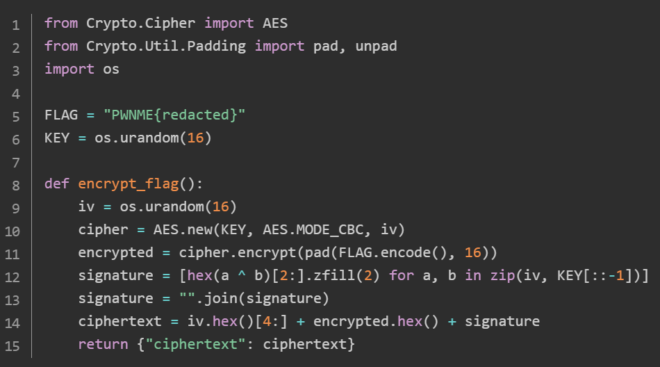
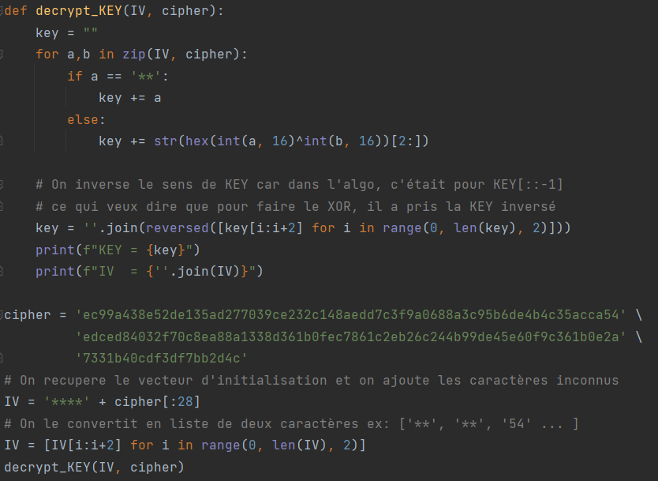
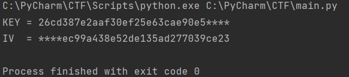
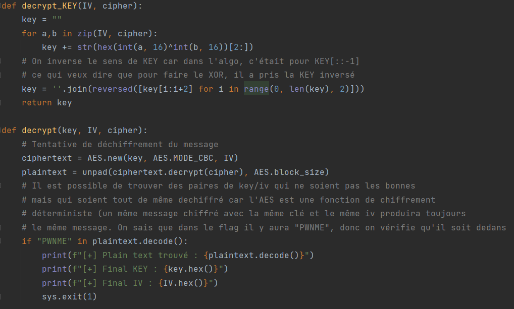
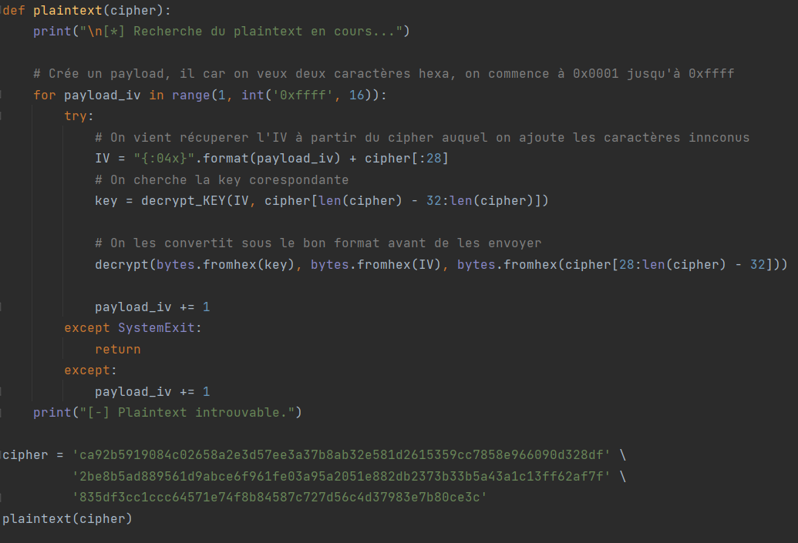

  

## Challenge Gib me Initials Victors 119 résolutions :

**Ennoncé :**
>Author: Ectario#7001
>
>Imagine making an encryption system. That's what someone did...
>Find a way to recover the flag.

### Analyse du code

On vient récupérer deux fichiers, un message chiffré :

Et son algorithme qui l’a chiffré :

Dans cet algorithme, on voit assez rapidement que c’est un chiffrement **AES CBC**. 
Afin de déchiffrer le message, l’idéal serait de mettre la main sur le **vecteur d’initialisation** (IV) et la **KEY**.

Si on inspecte le code un peu plus attentivement, on constate que notre message {“ciphertext”:XXX}, est composé de trois choses.
Le **vecteur d'initialisation** en hexadécimal sans ses deux premier caractères, le message chiffré et une variable **signature**.

Parfait, on a une presque un des éléments qu’il nous faut pour déchiffrer le message, et si on remonte légèrement le code, on constate qu'en réalité, on peut assez facilement récupérer **KEY**, à partir du **vecteur d’initialisation**.

### Récupération de l’IV/KEY

En effet, la signature est le **XOR** entre l’**IV** et la **KEY**. 
Je fais donc ce script:

C’est parfait, nous avons à présent presque tout pour déchiffrer le message. Vu qu’il ne manque que deux caractères pour chaque, je vais juste **brute force** pour obtenir le message. On pourrait le faire en deux boucles for, une pour le IV et une autre pour la KEY, cela fonctionnera, et nous trouverons le message, mais cela risque de prendre plusieurs heures.
Nous allons donc faire un **brute force** intelligente. Plutôt que de prendre dès le début, la KEY avec les deux caractères inconnus, nous allons **calculer la KEY** dans notre programme a partir de l'IV que nous allons brute force. Cela nous supprime une boucle et nous fait passer de 0xffff * 0xffff = **4 294 836 225 possibilités** à 0xffff = **65535 possibilités**.

### Brute force pour avoir le flag

