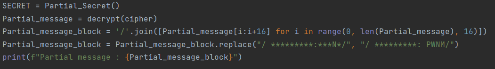

  

## Challenge Just a Xor 198 résolutions :

**Ennoncé :**
>Author: Eteck#3426
>
>You are in possession of an encrypted message as well as the algorithm that encrypted it. Find the original message PS: According to a reliable source who intercepted a part of the message before encryption, you have in your possession some characters of the orginal message (The * are the unknown parts of the message)

### Analyse du script

Tout d’abord, lorsque l’on télécharge le zip, on y trouve trois fichiers : `encrypt.py`, `intercepted-original-mesage.txt`, `message-encrypted.txt`.

Comme leurs titres le dit très bien, on retrouve le message chiffré : 

Certains caractères du message original:

Et l’algorithme qui a permis de le chiffrer:

On voit donc que le message à été chiffré en effectuant un **XOR**, entre chaque caractères du message et un secret (`cycle(SECRET)` permet de revenir au premier caractère lorsque le programme à atteint le dernier caractère du message car le secret un plus court que le message).

### Récupération d’une partie du SECRET

Et on voit aussi que le secret est calculé de manière aléatoire. Or, on connaît une partie du message original. Donc on peut par conséquent retrouver une partie du message en clair.
Je j’ai donc fais ce petit script :

Qui me permet d’obtenir :

### Récupération d’une partie du message

J’ai donc à présent, une partie de **SECRET**. Je peux donc essayer de voir si je ne peux pas trouver plus de caractères dans le message intercepté, car on le rappelle, il utilise `cycle(SECRET)` donc certes cela ne changera rien pour les 16 premiers caractères, mais pour le reste je devrais voir apparaître certains caractères.

Je viens donc réaliser cette nouvelle fonction :

Et j'obtiens :

Si on ajoute ces caractères à ceux du message intercepté, on voit que certains caractères sont nouveaux.

On sait que le flag est du genre : **PWNME{XXXXXXX}**

On peut donc conjecturer que je devrais avoir 

(On peut faire le même genre de conjecture à d’autres endroit)

Je viens donc séparer ce message en bloc de 16 caractères par un `/`

On voit donc que la partie qui nous intéresse est 

On récupère le nombre de caractères qui ser trouvent avant cette partie du message, et qui est de **64 caractères**.

### Récupération d’une autre partie du SECRET/message

On viens donc faire cette nouvelle fonction:

On a maintenant une bonne partie du secret. On vient donc réutiliser la fonction `decrypt()` pour avoir de nouveaux caractères dans le message.

Et on obtient

### Récupération du flag

Nous avons donc presque fini, on reprend les même étapes, en changeant **“oo\*\*\*uck\*\*or the”** par **“ood luck for the”** (cela correspond au découpage de 16 caractères).

Je change donc juste ces lignes				Par

			

Et le flag s’affiche

