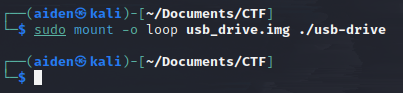
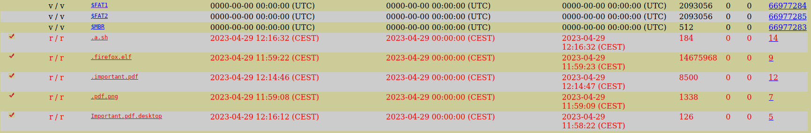
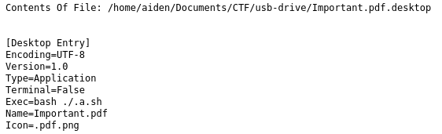
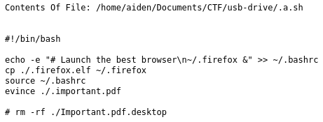
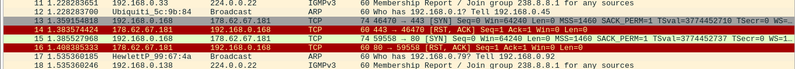

  

## Challenge Silver 69 résolutions :

**Ennoncé :**
>Author: Mr.NOODLE#9112
>
>Hey,
>I received a flash drive in my mailbox. It appears that the person who sent me the package was aware that I was using Linux. However, the flash drive self-destructed before I was able to make an image of it. To get the flag, you have to go to the showcase site of the >c2 in question.
>
>This is real malware, so be careful when running it, use a vm for malware analysis
>
>Checksum Sha256 of usb_drive.img : 8947e34165792040d86915aea29df01f5e65f49ccfd624032522720ffb87c379

### Récupération des fichiers

On vient télécharger le fichier `Silver` qui s'avère être un 7z.
On l’extrait et on obtient un fichier image nommé `usb_drive.img`.

La première chose à laquelle on pense, c'est de monter le fichier image dans un dossier nommé **usb-drive**.

Or si on se rend ensuite dans le fichier, on voit rapidement que celui-ci est vide.
Donc on va venir utiliser **Autopsy** qui est un logiciel qui va permettre de récupérer des documents qui ont été supprimés.

Il nous permet d’analyser l’image et d’obtenir d'intéressants fichiers.

### Analyse des fichiers récupéré

On y voit notamment un fichier `.pdf.png` qui contient juste une image et le fichier `.Important.pdf.desktop` qui est un raccourcis :

On peut donc y voir que qui va executer un programme nommé `.a.sh` qui est un script bash :

Ici, le programme va venir ajouter une ligne de commande au programme `~/.bashrc` qui va exécuter à chaque fois qu’un nouveau terminal est ouvert le programme `~/fierfox`.
Ensuite, il vient copier le fichier `.firefox.elf` dans le dossier `~/.firefox`.
Il vient ensuite recharger `~/.bashrc` avec la commande source, puis vient ouvrir le fichier `.important.pdf`.
Il y a une dernière ligne en commentaire pour supprimer le fichier `Important.pdf.desktop`.
Le fichier Important.pdf n’est rien de plus qu’un pdf contenant “Hello, this is important” et ne va pas vraiment nous intéresser.

Et pour finir, le plus important, le fichier `.firefox.elf`. L'extension .elf est le format de fichier binaire standard pour les systèmes UNIX. Or on sait, par l’énoncé, que cet exécutable envoie des informations vers un serveur distant.

### Interception du site malveillant

Par mesure de précaution, j’ai donc créé un VM pour exécuter ce programme.
Lors de son exécution, comme on peut s’en douter, il ne se passe rien visuellement, mais si on vient faire un scan du réseau avec **Wireshark**, on peut observer que lorsque l’on exécute le fichier, certaines trames apparaissent.

On y voit notamment 192.168.0.168 (qui est l’ip de ma VM) qui envoie des données au 178.62.67.181 sur le port 443.
Et si je rentre dans une barre de recherche, 178.62.67.181:443

On y voit une page web avec :

