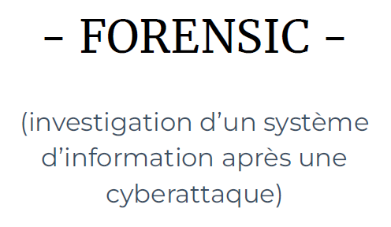
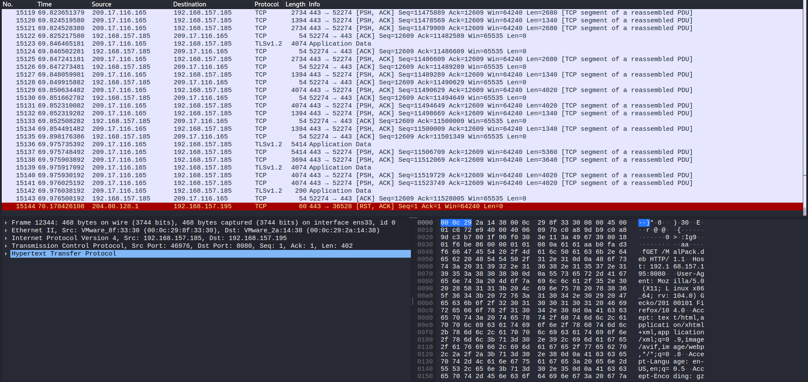
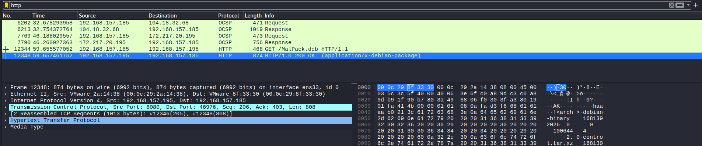
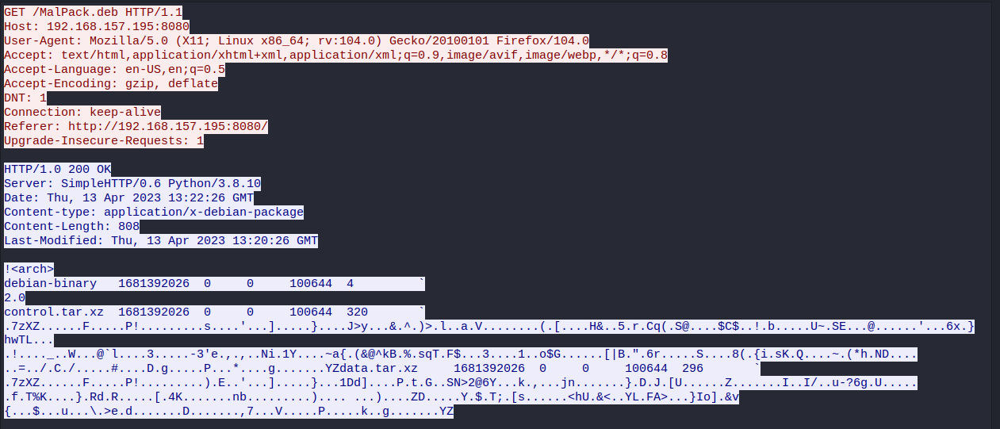
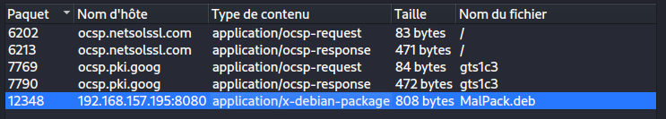
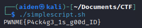

  

## Challenge kNOCk kNOC 198 résolutions :

**Ennoncé :**
>Author: Braguette#0169
>
>We have to monitor our network every day to make sure our admins don't help players get out of the game. We are sending you a suspicious capture. Do your job !

### Analyse du fichier

On vient télécharger le fichier **“kNOCk kNOCk”** qui s'avère être un .pcapng. C’est donc un fichier contenant un scan réseau.

Pour pouvoir le lire, je l’ouvre avec **Wireshark** et j'obtiens énormément de données :

Comme à chaque fois, la première étape est l'application d’un filtre. Ici je commence avec un filtre **http**.

Les données sont nettement moins importantes à analyser. Je viens à présent suivre le **flux http** et j'obtiens ceci :

### Extraction du document transmis

On y voit clairement qu’un client a envoyé une requête **HTTP GET** pour récupérer un fichier nommé, **“MalPack.deb”**. Le serveur est en “200 OK”, et envoie donc le fichier.
Afin de nous aussi récupérer ce fichier, je vais faire `Fichier → Exporter Objets → http`.
Je viens ensuite choisir la trame qui m'intéresse et l’exporter :

J’ai donc belle et bien le fichier **“MalPack.deb”** :

Ensuite, on va dans `/usr/local/bin` et on y trouve le fichier simplescript.sh que l’ion peux venir extraire pour l’exécuter ou bien juste l’ouvrir pour obtenir le flag :

