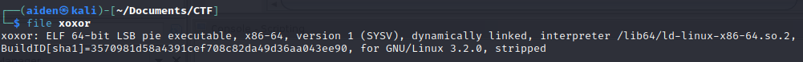
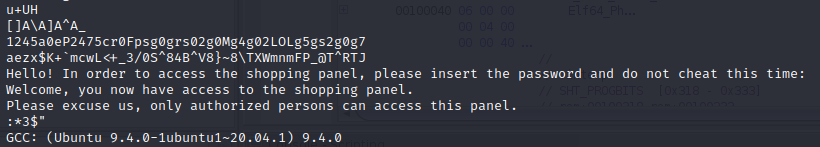
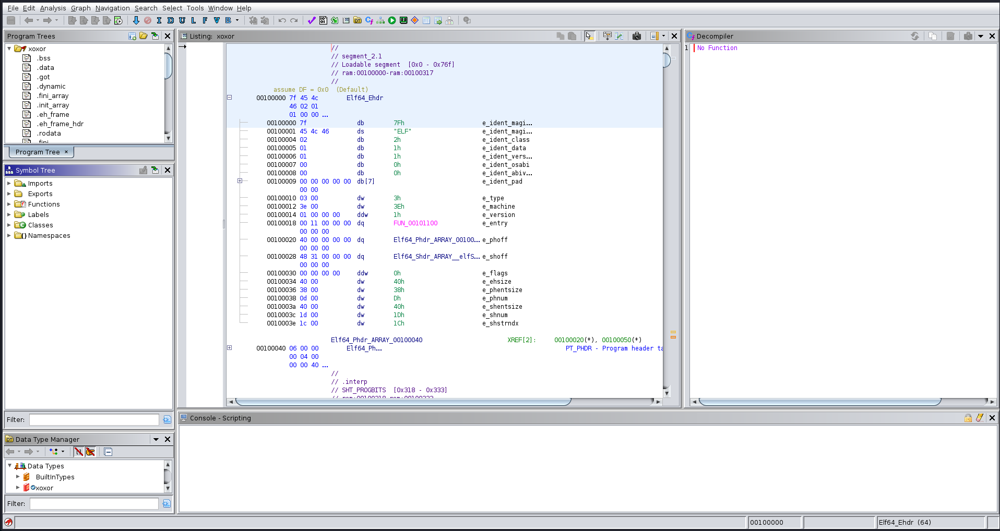
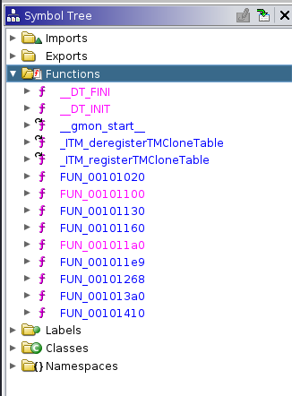
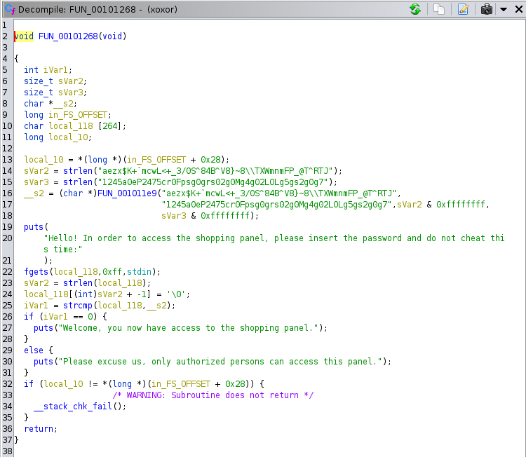
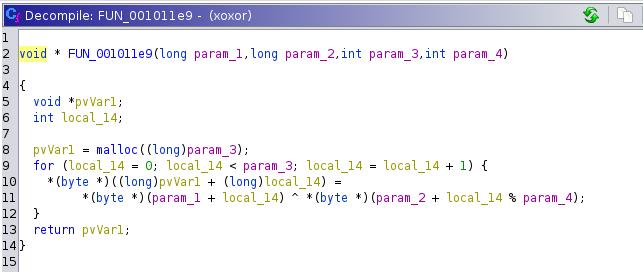

  

## Challenge “Xoxor” 230 résolutions :

**Ennoncé :**
>Author: Zerotistic#0001
>
>I need to buy that super duper extra legendary item no matter what !
>But I can't access their store... Maybe you can help me?

### Récupération des fichiers

Tout comme pour le précédent challenge, je viens télécharger le fichier `xoxor`, et fait un `file` dessus.

Comme pour `C Stands For C`, nous avons un fichier **ELF** sur **64-bits**. De la même façon, j’effectue aussi un `strings` même si c’est peu probable de trouver quelque chose.

Effectivement. Il va donc falloir à nouveau se servir de **Ghidra**. Je viens donc créer un nouveau projet et importer le fichier binaire et j’ouvre le binaire.

### Analyse du fichier

J’obtiens ensuite cette page :

Il suffit d’agrandir l’arborescence à gauche pour y retrouver toutes les fonctions utilisées.

Les fonctions sont obfusqué, mais étant donné qu’il y en a un nombre raisonnable, a force de les ouvrir on finit par tomber sur quelque chose d'intéressant, la fonction `FUN_00101268()`. En effet puisqu’elle contient ce programme qui semble être le main :

Ici ce qui nous intéresse c’est la 27.
En effet on peut voir que c’est l’itération qui permet de se connecter à l’application. Donc si je veux avoir la phrase `"Welcome, you now have access to the shopping panel."` d’afficher, j’aurais le flag. 

Mais pour cela, il faut que `stcmp(local_118, __s2) == 0`. Ce qui veut dire que `local_118` doit être la même chaîne de caractère que `__s2`.
Or, la ligne `fgets(local_118,0xff,stdin);` nous indique que va `local_118` correspondre à la saisie utilisateur. Donc, il suffit juste de trouver la valeur de `__s2`.
On peut voir plus haut, que va `__s2` prend la valeur retourné par la fonction `FUN_001011e9()`.

Et si j’ouvre cette fonction :

### Récupération du flag

On voit qu'en réalité c’est juste un **XOR**, comme son nom l’indique. Or la particularité du **XOR**, c’est que c = a xor b ⇔ a = c xor b
Donc il est très simple de retrouver la valeur retournée, car on connaît les deux chaînes passées en paramètre.
Un simple algorithme python permet de retrouver le flag :

