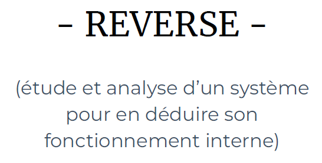

  

## Challenge C Stands For C 306 résolutions :

**Ennoncé :**

>Author: Zerotistic#0001
>
>So I heard about a secret shop who uses a strong password, but it seems like they forgot you were even stronger ! Hey, if you find the password I'll give you a flag. Sounds good? Sweet!

### Analyse du fichier

Je viens télécharger le fichier `c_stands_for_c`.  Avec la commande file, on peut voir que c’est un fichier **ELF** sur **64-bits**. Un fichier **ELF** est un fichier binaire standard pour les systèmes UNIX.

Je viens donc effectuer un `strings mon_fichier` et en remontant légèrement les lignes, on peut apercevoir quelque chose qui ressemble à un flag :

Malheureusement, ce n’est pas le flag. Il va donc falloir se salir les mains et s’allier de son plus fidèle ami pour le reverse, **Ghidra**. Je viens donc créer un nouveau projet et importer le fichier binaire.

J'ouvre à présent le fichier, et **Ghidra** me demande si je souhaite analyser le fichier et lui signal que oui.

J’obtiens ensuite cette page:

A première vue c'est une horreur. Mais si on fait attention, on fois à gauche au bandeau intéressant.

C’est la liste de toutes les fonctions utilisées pour le programme. On y voit notamment la fonction **main**.
Et si on va voir sont contenu, on retrouve bien le pseudo flag vu plus haut.

### Récupération du flag

Mais on voit aussi une autre fonction, `caesarCipher()`.
Tout s’explique à présent, si la valeur est très semblable mais n’est pas le flag c’est juste parce qu'elle a subi un **chiffrement césar** !
Pour rappel, un **chiffrement césar** consiste à décaler les lettres de l’alphabet d’un certain rang.
Afin de retrouver le flag je vais juste sur [decode césar](https://www.dcode.fr/chiffre-cesar) et rentre ma chaine de caractère et effectue un déchiffrement automatique. Et on peu apercevoir notre flag :

