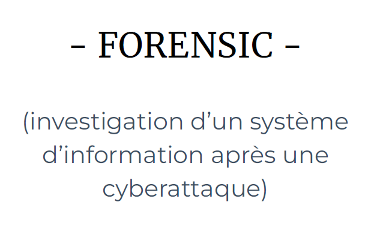
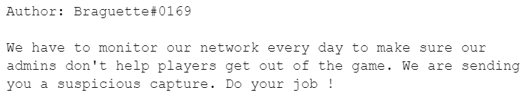

  

  

## Challenge “kNOCk kNOC” 198 résolutions :

#### Analyse du fichier

On vient télécharger le fichier “kNOCk kNOCk” qui s'avère être un .pcapng. C’est donc un fichier contenant un scan réseau.

Pour pouvoir le lire, je l’ouvre avec Wireshark et j'obtiens énormément de données :