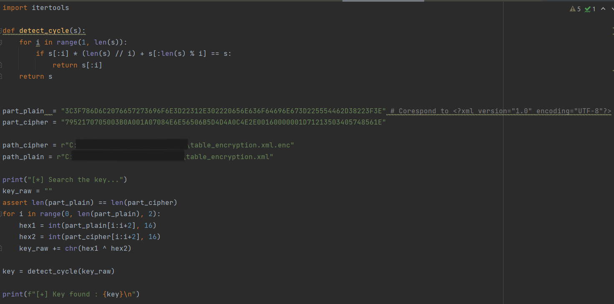
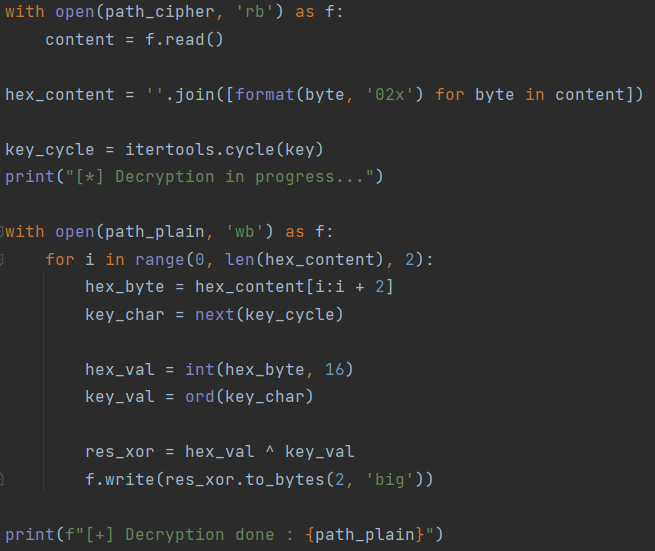
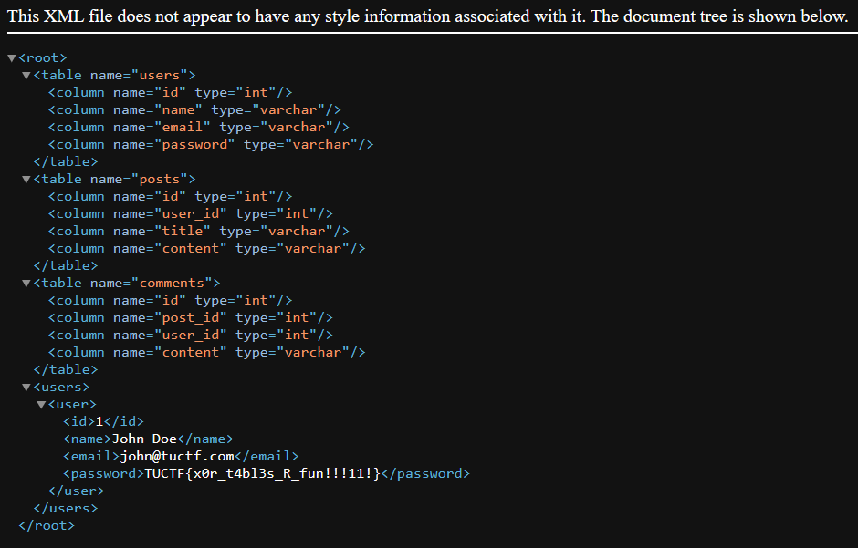

## Challenge “Table Encryption” 93 solved :

**Statement :**
>You can't crack my file! I am the exclusive owner of the encryption key!

We have access to a `table_encryption.xml.enc` file and that's about it. The only information we have is that the base file is an `.xml` file. An Internet search will reveal that this type of file very often starts with this header: `<?xml version="1.0" encoding="UTF-8"?>`.
But that doesn't tell us how it was encrypted. So I put forward a hypothesis. Very often in cryptography challenges, **XOR** is used to encrypt data and quite easily find the plaintext message (because A XOR B = C <=> A XOR C = B).
Since we know the ciphertext and part of the plaintext, I did a **XOR** between these two values, initially manually. And I could see that the key began with "Emoji". So there's a good chance that my hypothesis is correct. So I made an algorithm to find my key:

When executed, the result is :
`[*] Search the key...
[+] Key found : Emoji Moring Sta`

The key used is Emoji Moring Sta. All I have to do is continue my code, which will make a **XOR** between the encrypted file and the key.

We now have the decrypted file containing the flag.

