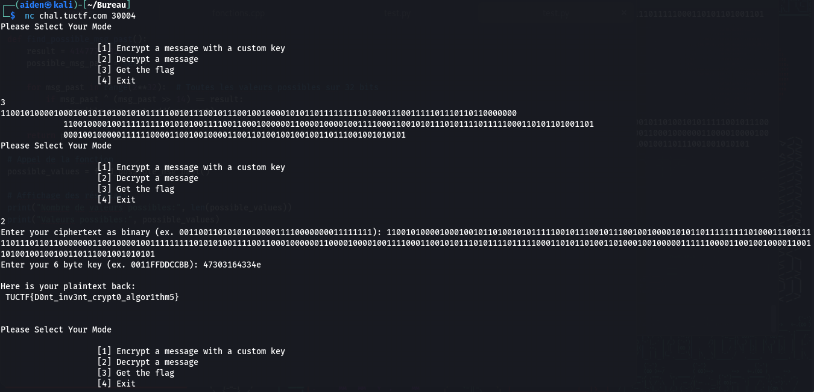

## Challenge “Table Encryption” 51 solved :

**Statement :**
>I made my own encryption algorithm, surely it is secure! I even made sure to redact the important parts!
>
>nc chal.tuctf.com 30004 

For this challenge, we have a `SimpleCipher_Pub.py` file. We quickly see an interesting section:

This sequence of 1s and 0s is marked as TUCTF{grab}. Another important function is `encrypt`.

Here, we have `binKey = str(bin(int('1'+key,base=16)))[3:]` which converts the key into binary,
`binPT=''
    for chr in pt:
        binPT+='{0:08b}'.format(ord(chr)) `
converts plaintext to binary, and finally
`binCText=''
    binPT=pad(binPT)
    for i in range(0,len(binPT),48):
        binCText+=xor(substitution(binPT[i:i+48]),binKey)`
allows you to **XOR** between `substitution(binPT[i:i+48])` and the binary key that will create the ciphertext.

Let's start here. We know the cipher text, so to find the key, we'll do `binKey+=xor(substitution(binPT[i:i+48]),binCText)`. But we don't know the value of substitution(binPT[i:i+48]). But since we have the encryption algorithm, we can use it to encrypt a message, e.g. TUCTF{IT_IS_AN_EXEMPLE}.

So we have a ciphertext, the key and the plaintext. Let's try a little algorithm to find our key from the cipher and the known part of the flag (TUCTF{). We take the first 48 characters of the cipher text (binPT[i:i+48]), which we **XOR** with the binary of TUCTF{.

Only, this way, we get 8d30b6f41a58 and not 0011aabbccdd. This is because the pattern is also corrupted. To find it again, simply perform a **XOR** between our ciphertext block of 48 and the key binary.

We get: `pattern: 100011010010000100011100010011111101011010000101`
So we modify our algorithm to obtain the corresponding pattern.

And we end up with the key 0011aabbccdd. All that's left is to replace the 48-character cipher block with the 48-character flag. We obtain the key 47303164334e, which then validates the challenge.

