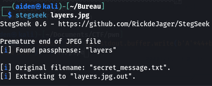
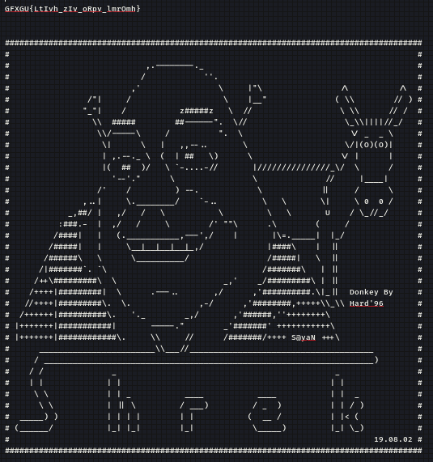
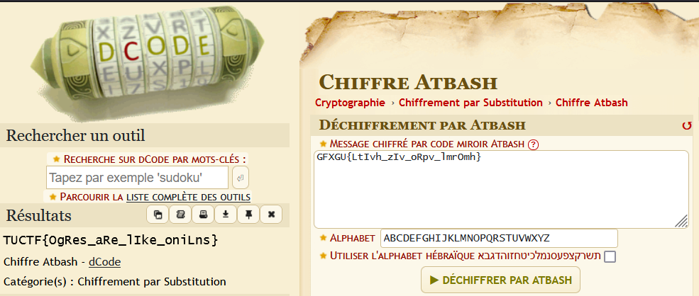

## Challenge “What Are You Doing In My Swamp” 209 solved :

**Statement :**
>This challenge is like ogres, it has layers

We have access to a `layers.jpg` file, but it seems to be corrupted. With an Internet search, we quickly come across [recovery jpg](https://www.file-recovery.com/jpg-signature-format.htm). We follow the instructions and obtain the following:

It shows Atbash Cipher but otherwise nothing special. So we'll use [stegseek](https://github.com/RickdeJager/stegseek) to see if it contains any hidden data. Execute this command:

The tool did find some hidden data, as follows

A semblance of a flag can be seen. We remember what was marked on the image, Atbash Cipher. So we go to this site [decode](https://www.dcode.fr/chiffre-atbash) to obtain the flag.

