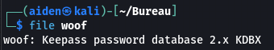
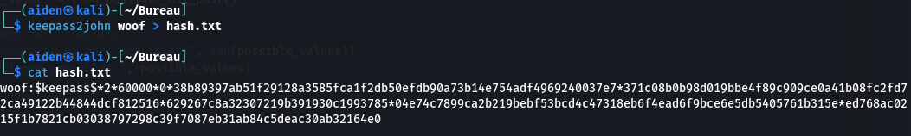
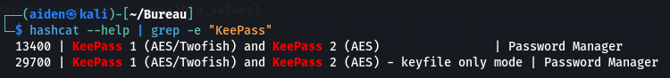
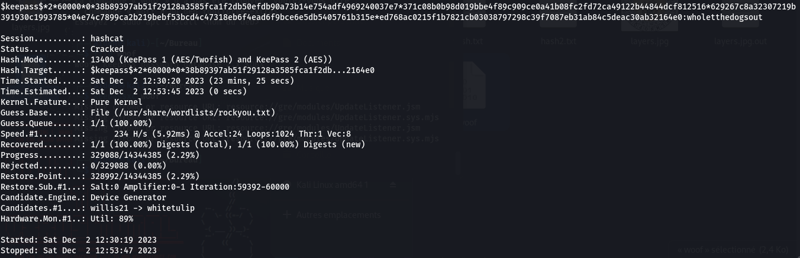
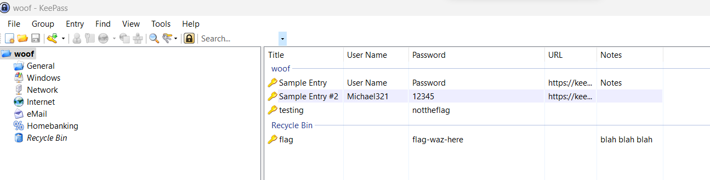
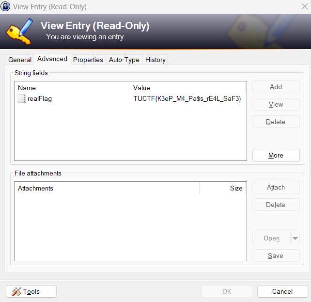

## Challenge “A.R.K. 2” 151 solved :

**Statement :**
>Woof woof bark bark (Note: to speed up the process, only include entries containing "dog" in your attempts)

We have access to a `woof` file. For the moment, it remains unknown. We're here to find out more.

We're dealing with a **KeePass** file. A quick [internet] search (https://davistechmedia.com/can-you-crack-a-keepass-database-if-you-forgot-your-password/) reveals that there are ways of finding the master password.
So we're going to do just that.

Well, we've recovered the hash. Now we just need to find the password. To do this, I used `hashcat`.

We must therefore use `13400` for **KeePass** passwords.
So we run this command: `$ hashcat -m 13400 -a 0 hash.txt /usr/share/wordlists/rockyou.txt`.
And after a few minutes :

The master password is therefore `wholetthedogsout`.
We open the file and obtain :

So we can see that the flag in the recycle garbage can has been here. To get a history of what happened, right-click --> Edit Entry. There's a History tab, where you can see the flag's previous value, and when you open it, you get the flag :

