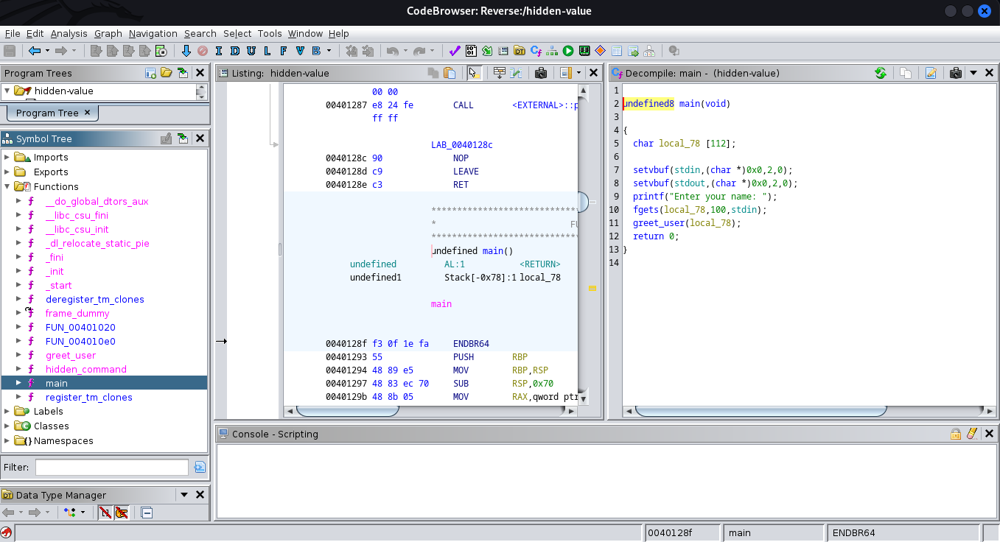

## Challenge “Hidden Value” 289 solved :

**Statement :**
>There's a hidden value in this program, can you find it?
>
>nc chal.tuctf.com 30011 

For this challenge, we have a `hidden-value` binary file. First, we open it with **Ghidra**.

Obviously nothing special in main, except that the `greet_user()` function is called. Let's take a closer look.

Here, we see something more interesting. A buffer overflow is possible because of the `strcpy`. The variable into which the user's name is copied has a length of 44, while the variable storing the user's name is 112. So if the user name is greater than 44, a buffer overflow will occur. Furthermore, we can see that the instruction for passing the iteration is that `local_c` must be -0x2152411, which corresponds to 0xFFFFFFDEADBEEF. We'll just have to inject the 'A' character 44 times to write outside the memory area, and then we'll just write deadbeef in little endian. Here's the payload:
<pre><code>$ python3 -c "import sys; sys.stdout.buffer.write(b'A'*44+b'\xef\xbe\xad\xde')"</pre></code>

Then we just inject it into the server to obtain the flag.

