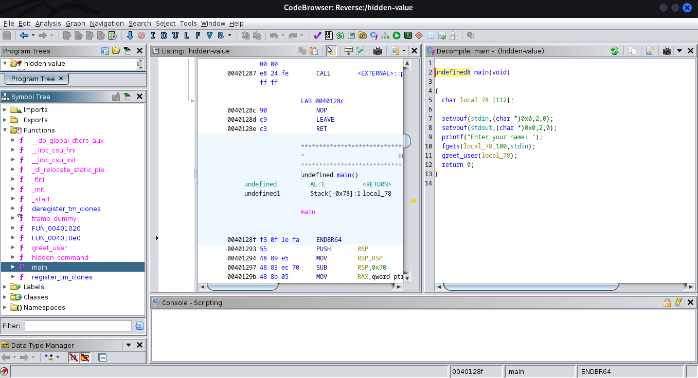
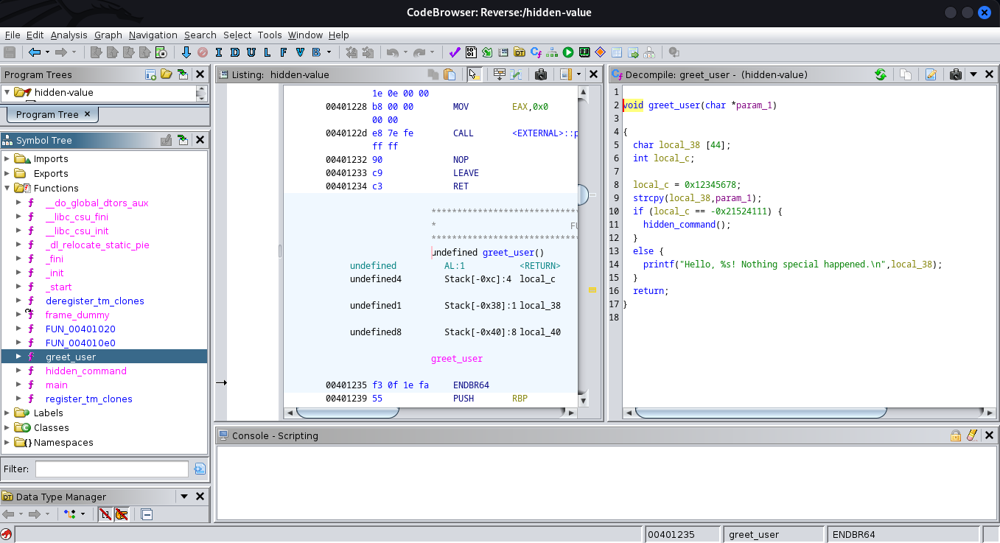
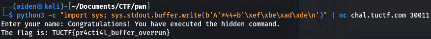

## Challenge “Hidden Value” 289 résolutions :

**Ennoncé :**
>There's a hidden value in this program, can you find it?
>
>nc chal.tuctf.com 30011 

Pour ce challenge, nous avons un fichier binaire `hidden-value`. On vient donc dans un premier temps l'ouvrir avec **Ghidra**

Visiblement rien de spécial dans le main, à part que la fonction `greet_user()` est appelé. Allons la voir de plus près.

Ici, on y voit quelque chose de plus intéressant. En effet un buffer overflow est réalisable à cause du `strcpy`. En effet la variable dans laquelle on vient copier le nom de l'utilisateur est d'une longueur de 44 tandis que celle qui stock le nom de l'utilisateur fait 112. Donc si jamais le nom de l'utilisateur fait plus que 44 un buffer overflow va avoir lieu. De plus, on voit que l'instruction pour passer l'itération est que `local_c` doit valoir -0x2152411 qui correspond à 0xFFFFFFFFDEADBEEF. On va donc juste avoir à injecter 44 fois le caractère 'A' pour écrire en dehors de la zone mémoire, et ensuite, on vient juste écrire deadbeef en little endian. Voici donc le payload :
<pre><code>$ python3 -c "import sys; sys.stdout.buffer.write(b'A'*44+b'\xef\xbe\xad\xde')"</pre></code>

Ensuite, on vient juste l'injecter dans le serveur pour obtenir le flag.

