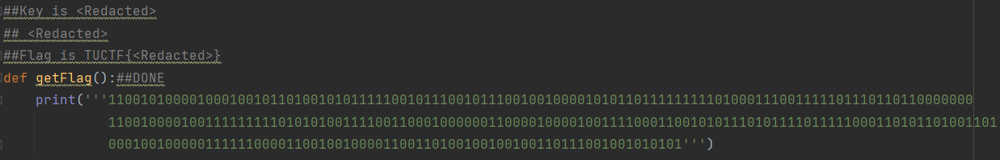
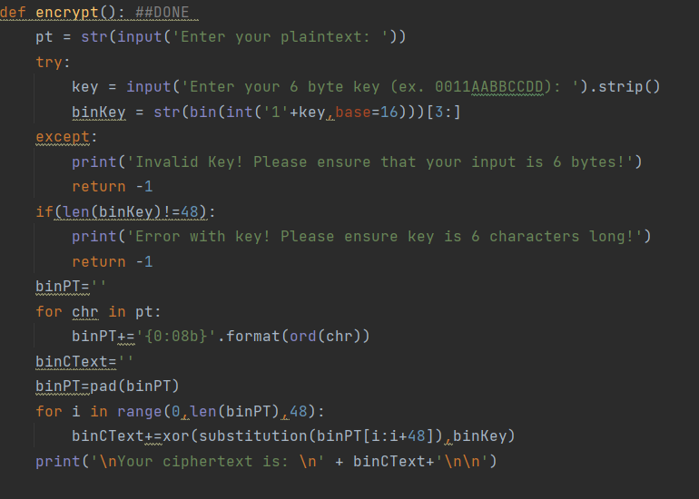
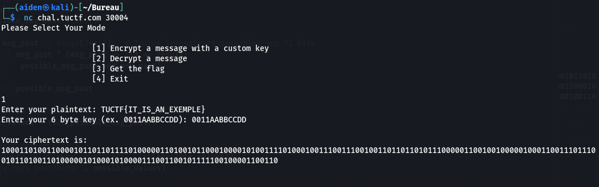
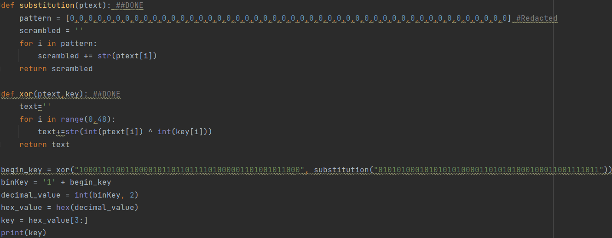
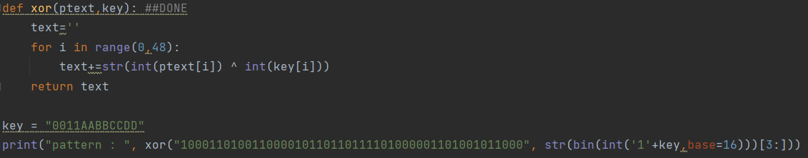
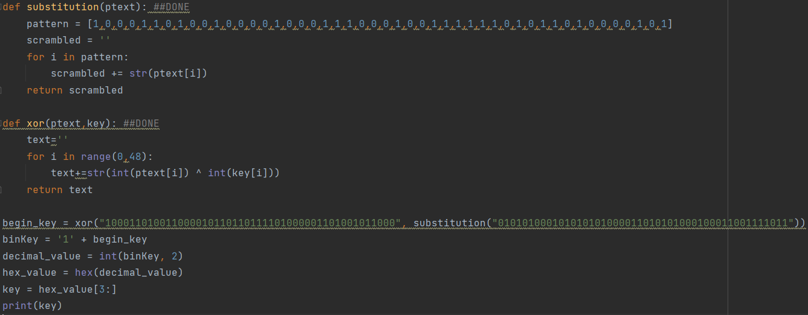
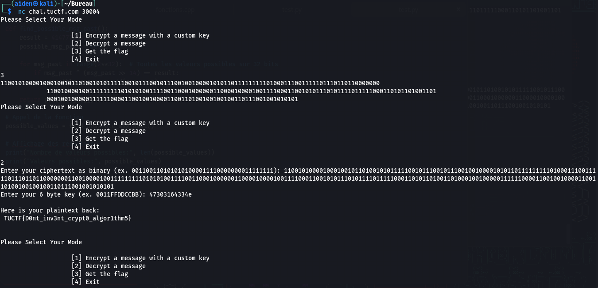

## Challenge “Simple Cipher” 51 résolutions :

**Ennoncé :**
>I made my own encryption algorithm, surely it is secure! I even made sure to redact the important parts!
>
>nc chal.tuctf.com 30004 

Pour ce challenge nous avons un fichier `SimpleCipher_Pub.py`. On voit rapidement une section interessante :

Il est marqué que cette suite de 1 et de 0 coresspond à TUCTF{grabage}. Une autre fonction importante est la fonction `encrypt`

Ici on a `binKey = str(bin(int('1'+key,base=16)))[3:]` qui vient convertir la clé en binaire.
`binPT=''
    for chr in pt:
        binPT+='{0:08b}'.format(ord(chr)) `
permet de convertir le plain text en binaire.

Et enfin
`binCText=''
    binPT=pad(binPT)
    for i in range(0,len(binPT),48):
        binCText+=xor(substitution(binPT[i:i+48]),binKey)`
permet de faire un **XOR** entre `substitution(binPT[i:i+48])` et la clé en binaire qui va crée le cipher text.

On va donc commencer par ici. On connait le cipher text, donc pour retrouver la clé on va faire `binKey+=xor(substitution(binPT[i:i+48]),binCText)`. Mais on ne connait pas la valeur de substitution(binPT[i:i+48]). Mais étant donné que l'on a l'algorithme de chiffrement, on peut donc s'en servir pour chiffrer un message, par exemple TUCTF{IT_IS_AN_EXEMPLE}

Nous avons donc un cipher text, la clé et le plain text. On vient donc faire un petit algorithme pour essayer de retrouver notre clé à partir du cipher et de la partie connu du flag (TUCTF{). On prend les 48 premiers caractères du cipher text (binPT[i:i+48]), que l'on **XOR** avec le binaire de TUCTF{.

Seulement, de cette manière on obtient 8d30b6f41a58 et non 0011aabbccdd. C'est parceque le pattern est aussi corrompus. Pour le retrouver rien de plus simple, on vient faire un **XOR** entre notre block de 48 du cipher text et le biniare de la clé.

On obtient : `pattern :  100011010010000100011100010011111101011010000101`
On modifie donc notre algorithme pour avoir le pattern correspondant.

Et on retombe bien sur la clé 0011aabbccdd. Il reste donc plus qu'à remplacer le block de 48 du cipher par les 48 caractères du flag. On obtientla clé 47303164334e qui permet ensuite de valider le challenge.

