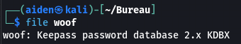
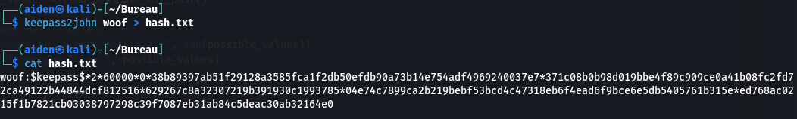
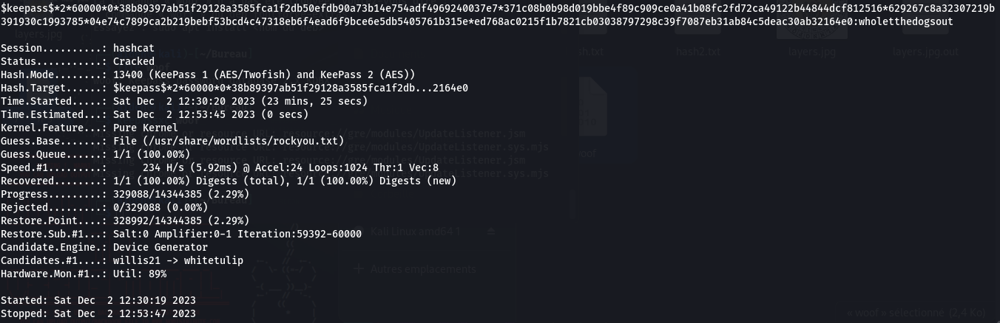
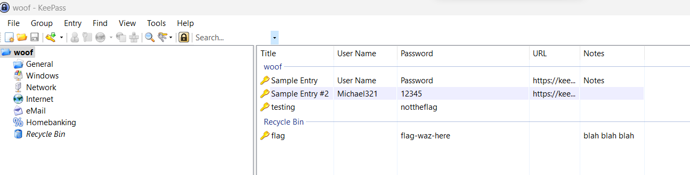
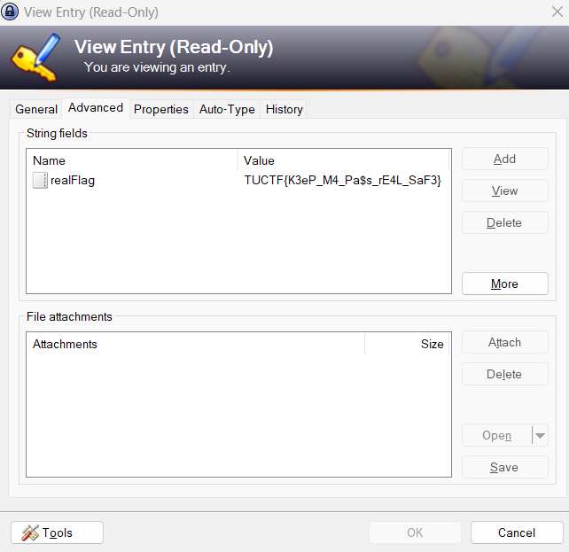

## Challenge “A.R.K. 2” 151 résolutions :

**Ennoncé :**
>Woof woof bark bark (Note: to speed up the process, only include entries containing "dog" in your attempts)

Nous avons accès un fichier `woof`. Pour l'instant il reste inconnu. On vient donc essayer d'en savoir plus.

Nous avons à faire à un fichier **KeePass**. Avec une rapide recherche [internet](https://davistechmedia.com/can-you-crack-a-keepass-database-if-you-forgot-your-password/) on se rend compte qu'il est exister des moyens de retrouver le master password.
Nous allons donc faire exactement cela.

Bien, nous avons récuperer le hash. Il nous reste plus qu'à retrouver le mot de passe. Pour cela j'ai utilisé `hashcat`.

Il faut donc utiliser `13400` pour les mot de passe **KeePass**.
On vient donc exécuter cette commande : `$ hashcat -m 13400 -a 0 hash.txt /usr/share/wordlists/rockyou.txt`
Et après quelque minutes :

Le master password est donc `wholetthedogsout`.
On ouvre donc le fichier et on obtient :

On voit donc que dans la corbeille le flag à été ici. Pour avoir un historique de ce qu'il s'est passé, on vient faire clique droit --> Edit Entry. Il y a un onglet History, on y vois donc l'ancienne valeur du flag, et lorsqu'on l'ouvre on obtient le flag :

